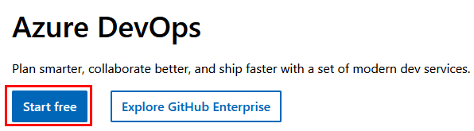
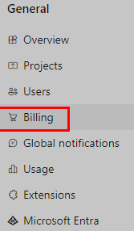
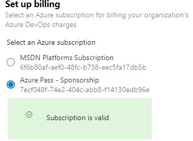
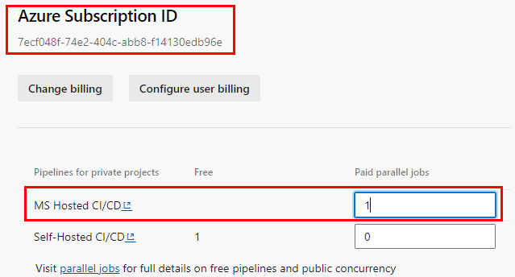
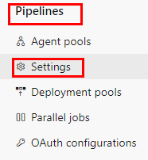
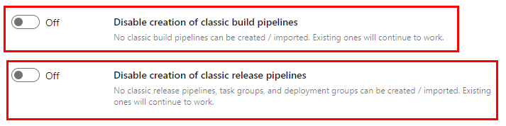

# Laboratorio 0. Preparación del ambiente de Azure DevOps

## Objetivo de la práctica:

Al finalizar la práctica, serás capaz de:

- Validar y preparar el ambiente de la organización de Azure DevOps

## Duración aproximada:
- 15 minutos.

---

**[Lista General](/README.md)** | **[Siguiente ➡️](/Capítulo1/lab1.md)**

---

## Prerequisitos:
- Tener una cuenta activa en Azure.

## **Instrucciones:**

### Tarea 1. Configuración del Proyecto en Azure DevOps.

Paso 1. Inicia sesión en **[Azure DevOps](https://dev.azure.com/)**

Paso 2. Clic en el botón **`Start free`**.

Paso 3. Autentícate con la cuenta de **Azure/Microsoft** otorgada en clase.

**NOTA:** Si es la primera vez que usas tu cuenta continúa con los pasos de autenticación y creación de la organización de **Azure DevOps**.

Paso 4. Una vez que la nueva organización se abra en Azure DevOps, haz clic en **`Organization Settings`** en la esquina inferior izquierda.

Paso 5. En la pantalla de configuración de la organización, haz clic en **`Billing`** (abrir esta pantalla puede tardar unos segundos).

Paso 6. Haz clic en el botón **`Set up Billing`** y en el lado derecho de la pantalla selecciona la suscripción **`Personal/Patrocinio o la asignada en el curso`** y haz clic en el botón **`Save`** para vincular la suscripción con la organización.

**NOTA:** La suscripción de la imagen puede ser diferente a la tuya.

Paso 7. Una vez que la pantalla muestre el ID de Suscripción de Azure vinculado en la parte superior, cambia el número de **`MS Hosted CI/CD`** de **0 a 1**. Luego, haz clic en el botón **`Save`** en la parte inferior.

**NOTA:** Recuerda que el ID de la suscripción es diferente al de la imagen.

Paso 8. En el menú de **Organization Settings**, dirígete a la sección **Pipelines** y haz clic en **`Settings`**.

Paso 9. Desactiva el interruptor para **Disable creation of classic build pipelines** y **Disable creation of classic release pipelines**.

**NOTA:** No es necesario guardar.

**IMPORTANTE:** Espera al menos **3 horas** antes de utilizar las capacidades de CI/CD para que los nuevos ajustes se reflejen en el backend. De lo contrario, seguirás viendo el mensaje **"No se ha adquirido ni concedido paralelismo alojado"**.

**¡LABORATORIO FINALIZADO!**
 
---

**[Lista General](/README.md)** | **[Siguiente ➡️](/Capítulo1/lab1.md)**

---
