# Laboratorio 2. Configuración inicial en Azure Databricks 

## Objetivo de la práctica:

Al finalizar la práctica, serás capaz de:

- Crear y configurar un workspace y un clúster en Azure Databricks.<br>
- Familiarizarse con el entorno de trabajo en Databricks.

## Duración aproximada:

- 15 minutos.

---

**[⬅️ Atrás](https://netec-mx.github.io/MLOPS-DATABRI/Cap%C3%ADtulo1/lab0.html)** | **[Lista General](https://netec-mx.github.io/MLOPS-DATABRI/)** | **[Siguiente ➡️](https://netec-mx.github.io/MLOPS-DATABRI/Cap%C3%ADtulo2/lab2.html)**

---

## Instrucciones:

### Tarea 1. Crear un Workspace en Azure Databricks.

En esta tarea, podrás configurar el entorno base en Azure creando un workspace de Databricks, que será el espacio de trabajo principal donde podrás configurar clústeres, crear notebooks y ejecutar procesos de datos.

Paso 1. Inicia sesión en el portal de **Azure** en [https://portal.azure.com](https://portal.azure.com).

**NOTA:** El usuario y contraseña se asignaron al inicio del laboratorio.

Paso 2. En el menú principal, selecciona **Crear un recurso**.

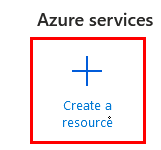

Paso 3. En el campo de búsqueda, escribe **Azure Databricks** y selecciona el recurso.

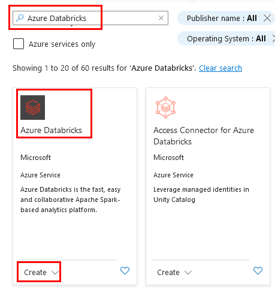

Paso 4. Haz clic en **Crear** para iniciar la configuración del workspace.

Paso 5. Configura los siguientes parámetros:

- **Subscription**: Selecciona la suscripción de Azure indicada en el curso.
- **Resource Group**: Crea uno nuevo llamado **`dbricksrg-XXXX-###`**, sustituye las **X** por las letras iniciales de tu nombre y el simbolo **#** por 3 numereos aleatorios.
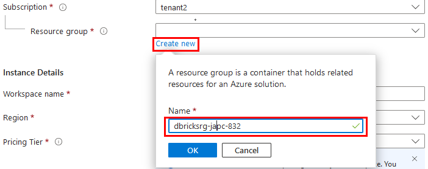
- **Workspace name**: Escribe el nombre **`dbricksspace-XXXX-###`**, repite la sustitución de las **X** y **#** para llevar una consistencia.
- **Region**: Define la región asignada al inicio del curso.
- **Pricing Tier**: Selecciona el nivel de precios **Standard (Apache Spark, Secure with Microsoft Entra ID)**.
  
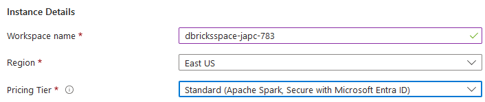

**NOTA:** El resto de los valores se quedan por defecto.

Paso 6. Haz clic en **Review + create** y luego en **Create** para desplegar el workspace. 

Paso 7. Espera unos **2:30 minutos** a que el deployment finalice, y luego selecciona **Go to Resource** para abrir tu nuevo workspace.

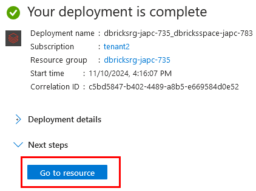

**¡TAREA FINALIZADA!** 

Ahora tienes un workspace de Azure Databricks creado y listo para usar.

### Tarea 2. Crear un clúster en Azure Databricks.

Con el workspace creado, el siguiente paso es configurar un clúster, el cual te proporcionará los recursos computacionales necesarios para ejecutar operaciones y procesar datos.

Paso 1. En la página del servicio de Databricks en Azure, da clic en **Launch Workspace**.

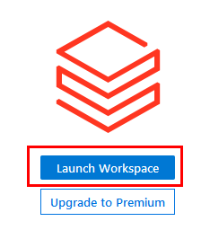

Paso 2. Dentro del workspace **recién creado**, selecciona **Compute** en el menú lateral izquierdo.

Paso 3. Haz clic en **Create compute** y configura los siguientes parámetros:

- **Nombre del clúster**: **`dbcluster-XXXX-###`**, sutituye las **X** y los **#** respectivamente.

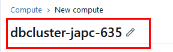

- **Cluster Mode**: Selecciona **Single node**.

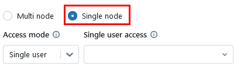

- **Node type**: Selecciona el servidor **Standard_D4s_v3**.

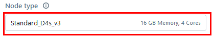

- **Terminate after**: Desmarca la casilla

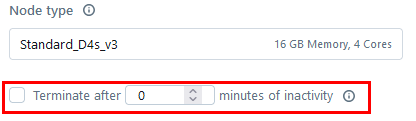

**NOTA:** El resto de los valores se quedaran por defecto.

Paso 4. Haz clic en **Create compute** y espera a que se active.

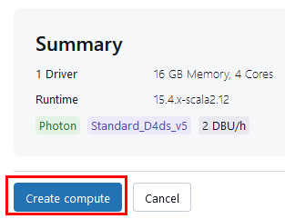

**¡TAREA FINALIZADA!**

Ahora tienes un clúster creado y listo para ejecutar tus procesos.

### Tarea 3. Familiarizarse con el entorno de Notebooks.

En esta tarea, explorarás el entorno de notebooks de Databricks. Los notebooks son espacios colaborativos ideales para trabajar con código, realizar pruebas y visualizar datos.

Paso 1. Verifica que se haya creado correctamente, como lo muestra la imagen.

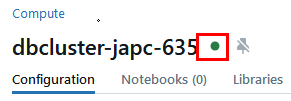

Paso 2. Una vez creado el clúster, navega a **Workspace** y selecciona **Create -> Notebook**.

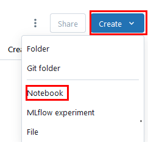

Paso 3. Nombra el notebook como **`mlops-notebook`** y selecciona **Python** como lenguaje.

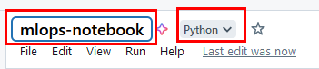

Paso 4. Conéctalo al clúster (el que creaste previamente).

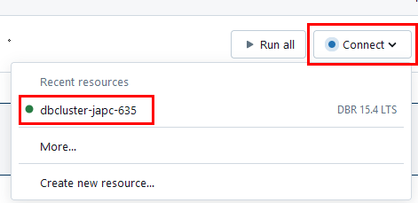

Paso 5. Ejecuta una celda con un comando básico de Python, como `print("¡Hola, Databricks!")`, para probar el entorno.

```
print("¡Hola, Databricks!")
```

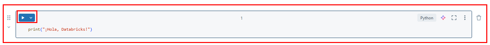

Paso 6. El resultado debe de ser la impresión del texto.

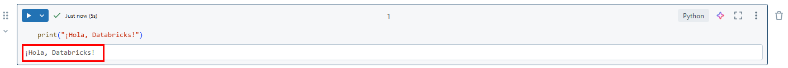

**¡TAREA FINALIZADA!** 

Ya estás familiarizado con el entorno de notebooks y has probado ejecutar un comando básico en Python.

**¡LABORATORIO FINALIZADO!**

### Resultado esperado:

Creamos un workspace en Azure Databricks como entorno base, configuramos un clúster para ejecutar análisis y procesar datos, y exploramos el entorno de notebooks, realizando una prueba básica en Python para verificar el funcionamiento.


---

**[⬅️ Atrás](https://netec-mx.github.io/MLOPS-DATABRI/Cap%C3%ADtulo1/lab0.html)** | **[Lista General](https://netec-mx.github.io/MLOPS-DATABRI/)** | **[Siguiente ➡️](https://netec-mx.github.io/MLOPS-DATABRI/Cap%C3%ADtulo2/lab2.html)**

---
