# Laboratorio 2. Carga y procesamiento de datos

## Objetivo de la práctica:

Al finalizar la práctica, serás capaz de:

- Conectar Azure Databricks a una fuente de datos externa.
- Cargar datos en un DataFrame de PySpark.

## Duración aproximada:
- 20 minutos.

---

**[⬅️ Atrás](/Capítulo1/lab1.md)** | **[Lista General](/README.md)** | **[Siguiente ➡️](/Capítulo3/lab3.md)**

---

## Instrucciones 

### Tarea 1. Conectar a la Fuente de Datos.

En esta tarea, establecerás una conexión a una fuente de datos externa desde Azure Databricks, como una URL pública o una base de datos en Azure.

**NOTA IMPORTANTE:** En caso de haber eliminado o cerrado tu workspace. Repite los siguientes pasos para acceder.

Resource Groups ---> dbricks-XXXX-### ---> Azure Databricks Service ---> Lunch Workspace ---> Workspace.

**NOTA:** En caso de haber eliminado el cluster repite la **Tarea 2** del **Laboratorio 1**.

Paso 1. Abre tu **notebook** en Azure Databricks y asegúrate de que el clúster está activo.

**NOTA:** Sino realiza el laboratorio 1 para crearlo de nuevo.

Paso 2. Define la fuente de datos usando la URL proporcionada para el archivo `ventasejemplo.csv`.

Paso 3. Abre una pestaña en tu navegador y pega el siguiente link para descargar los datos que se usaran en el laboratorio.

```
https://s3.us-west-2.amazonaws.com/labs.netec.com/courses/BigDataSciencePro/V0.0.1/ventasejemplo.csv
```

**Estructura**

| id | nombre_cliente | producto   | cantidad | precio_unitario | fecha_venta |
|----|----------------|------------|----------|-----------------|-------------|
| 1  | Juan Perez     | Ordenador  | 1        | 800.00         | 2024-01-01  |
| 2  | Maria Lopez    | Teclado    | 2        | 25.00          | 2024-01-02  |
| 3  | Carlos Garcia  | Ratón      | 1        | 15.00          | 2024-01-03  |

Paso 4. Da clic en la opcion **New** del menú lateral izquierdo.

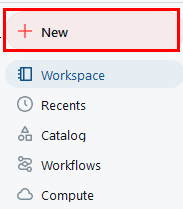

Paso 5. En el menú selecciona **Add or upload data**.

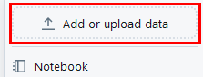

Paso 6. Da clic en la opción **Create or modify table**.

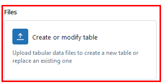

Paso 7. Busca y carga el archivo **ventasejemplo.csv**.

Paso 8. Una vez que cargue da clic en el botón inferior lateral derecho **Create table**.

Paso 9. Selecciona **Workspace** ---> **mlops-notebook** para abrir tu libreta nuevamente.

Paso 10. Agrega una celda nueva en tu libreta.

**NOTA:** Solo se habilita cuando pasas el puntero en esa zona.

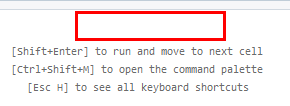

Paso 11. En la celda nueva agrega el codigo siguiente para traer los datos.

```
data_path = "dbfs:/user/hive/warehouse/ventasejemplo"
```

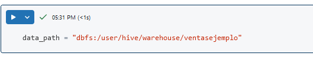

Paso 5. Ejecuta la celda. No habra salida.

**TAREA FINALIZADA**

Se ha establecido la ruta a la fuente de datos en DBFS.

### Tarea 2. Cargar los Datos en un DataFrame.

En esta tarea, cargarás los datos en un DataFrame de PySpark para su procesamiento y análisis.

Paso 1. Agrega una nueva celda y usa el método `spark.read` para leer los datos de la ruta en DBFS y cargarlo en un DataFrame.

```
df = spark.read.format("delta").load(data_path)
```

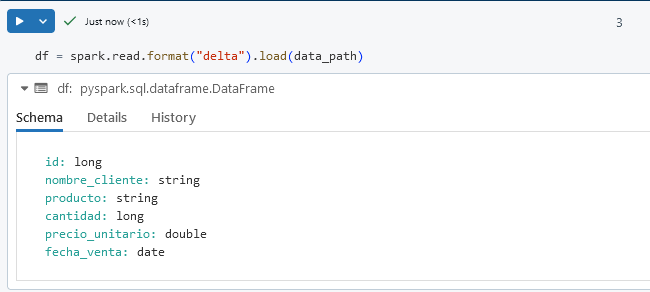

Paso 2. Agrega otra celda. Verifica la estructura del DataFrame con el siguiente comando.

```
df.printSchema()
```

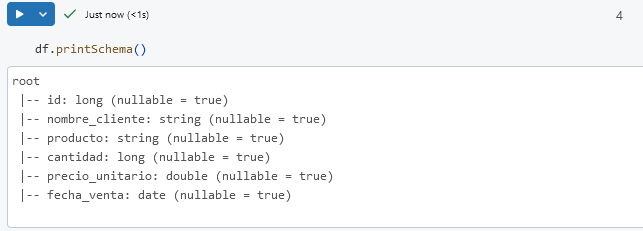

Paso 3. En otra celda. Visualiza las primeras filas de datos para confirmar la carga correcta.

```
df.show(5)
```

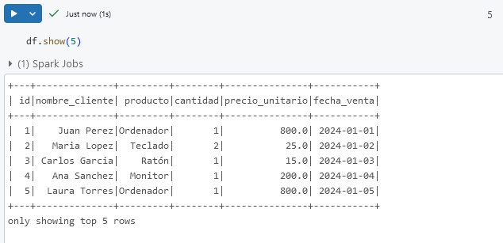

**TAREA FINALIZADA**

Los datos se han cargado exitosamente en un DataFrame de PySpark.

### Tarea 3: Realizar Transformaciones Básicas en el DataFrame

En esta tarea, aplicarás transformaciones al DataFrame, como seleccionar columnas, filtrar filas y agregar una columna nueva.

Paso 1. En otra celda. Selecciona las columnas específicas usando `select`. Por ejemplo, selecciona solo las columnas `nombre_cliente`, `producto` y `cantidad`.

```
df_selected = df.select("nombre_cliente", "producto", "cantidad")
df_selected.show(5)
```

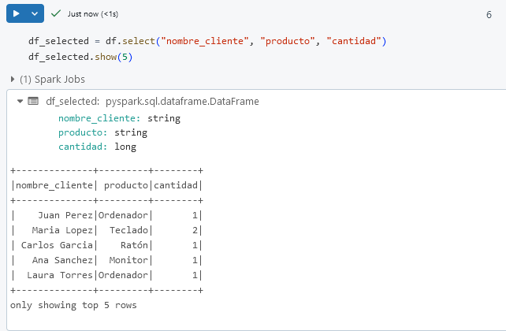

Paso 2. Filtra los datos para incluir solo filas donde el `producto` sea **Ordenador**.

```
df_filtered = df.filter(df["producto"] == "Ordenador")
df_filtered.show(5)
```

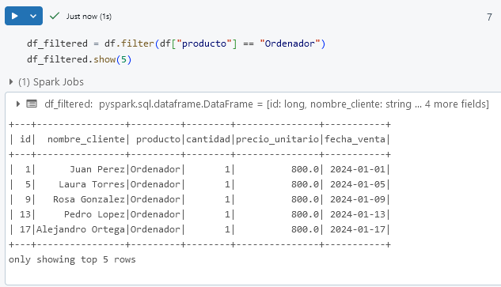

Paso 3. Crea una nueva columna llamada `total_venta`, que sea el producto de `cantidad` y `precio_unitario`.

```
df_with_total = df.withColumn("total_venta", df["cantidad"] * df["precio_unitario"])
df_with_total.show(5)
```

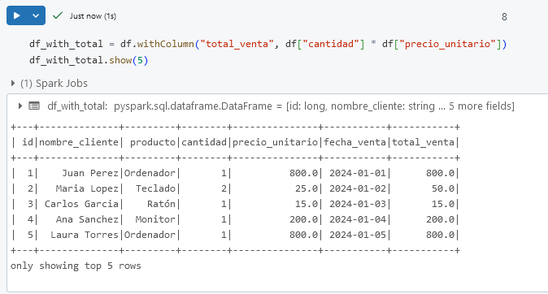

**TAREA FINALIZADA**

Se han aplicado transformaciones básicas al DataFrame y los datos están listos para análisis adicionales.

**¡LABORATORIO FINALIZADO!**

### Resultado esperado

Al completar este laboratorio, habrás aprendido a acceder a datos en DBFS, cargar datos en un DataFrame y realizar transformaciones básicas, estableciendo una base sólida para el procesamiento y análisis de datos.


---

**[⬅️ Atrás](/Capítulo1/lab1.md)** | **[Lista General](/README.md)** | **[Siguiente ➡️](/Capítulo3/lab3.md)**

---