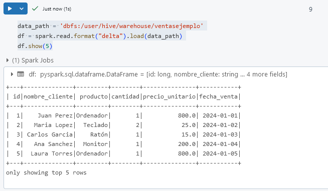
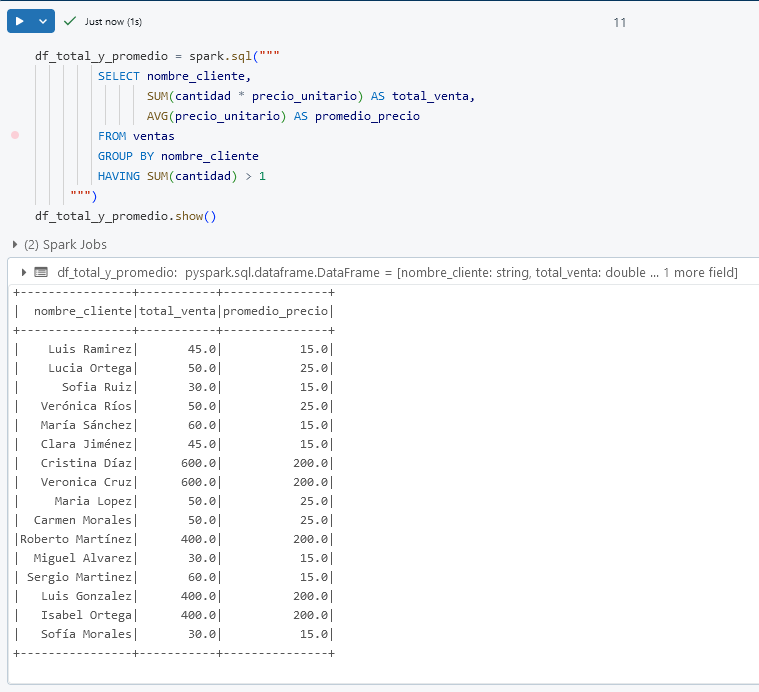
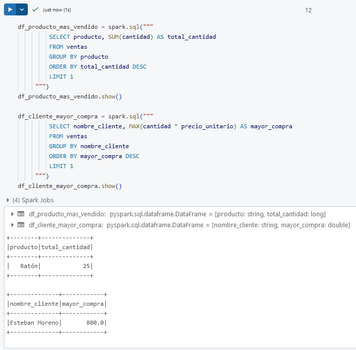
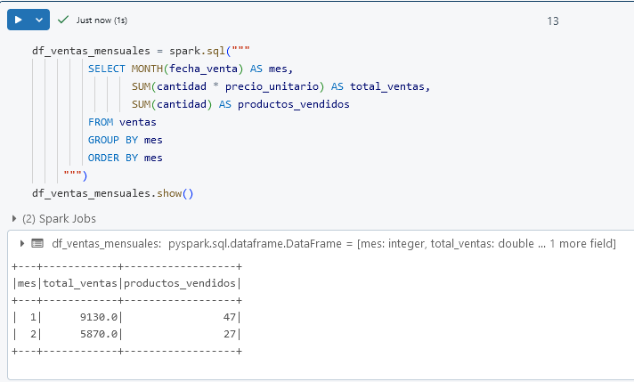
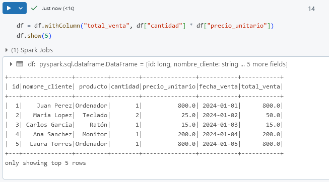
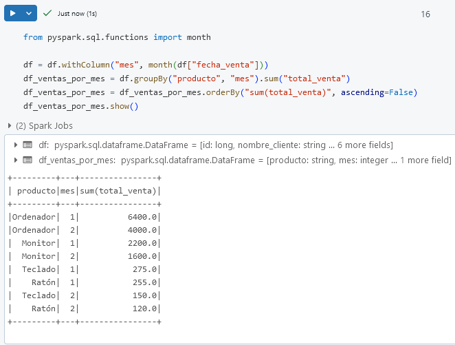

# Laboratorio 3. Consultas y transformaciones en DataFrames

## Objetivo de la práctica:

Al finalizar la práctica, serás capaz de:

- Realizar consultas SQL avanzadas sobre un DataFrame.
- Aplicar transformaciones para modificar y analizar los datos.
- Practicar la creación de columnas derivadas y agrupaciones avanzadas.

## Duración aproximada:
- 25 minutos.

---

**[⬅️ Atrás](/Capítulo2/lab2.md)** | **[Lista General](/README.md)** | **[Siguiente ➡️](/Capítulo4/lab4.md)**

---

## Instrucciones 

### Tarea 1. Registrar el DataFrame como una Vista Temporal.

En esta tarea, crearás una vista temporal a partir de un DataFrame para ejecutar consultas SQL directamente sobre los datos.

**NOTA IMPORTANTE:** En caso de haber eliminado o cerrado tu workspace. Repite los siguientes pasos para acceder.

Resource Groups ---> dbricks-XXXX-### ---> Azure Databricks Service ---> Lunch Workspace ---> Workspace.

**NOTA:** En caso de haber eliminado el cluster repite la **Tarea 2** del **Laboratorio 1**.

Paso 1. En una nueva celda de tu libreta Carga los datos en un DataFrame si aún no lo has hecho. Utiliza la ruta en DBFS.

**NOTA:** Si ya lo tienes cargado avanza al paso 2.

```
data_path = 'dbfs:/user/hive/warehouse/ventasejemplo'
df = spark.read.format("delta").load(data_path)
df.show(5)
```



Paso 2. Registra el DataFrame como una vista temporal llamada `ventas` para realizar consultas SQL.

```
df.createOrReplaceTempView("ventas")
df.show(5)
```

**¡TAREA FINALIZADA!**

El DataFrame se ha registrado como una vista temporal y está listo para consultas SQL.

### Tarea 2. Ejecutar Consultas SQL Avanzadas sobre el DataFrame.

En esta tarea, realizarás consultas SQL avanzadas sobre el DataFrame para extraer y analizar patrones complejos en los datos.

Paso 1. En una nueva celda, ejecuta una consulta SQL para obtener el total de ventas y el promedio de `precio_unitario` por cliente, solo para aquellos que compraron más de un producto.

```
df_total_y_promedio = spark.sql("""
         SELECT nombre_cliente, 
                SUM(cantidad * precio_unitario) AS total_venta, 
                AVG(precio_unitario) AS promedio_precio
         FROM ventas
         GROUP BY nombre_cliente
         HAVING SUM(cantidad) > 1
     """)
df_total_y_promedio.show()
```



Paso 2. Realiza una consulta que muestre el producto más vendido en términos de `cantidad` y el cliente con la compra de mayor `total_venta`.
   
```
df_producto_mas_vendido = spark.sql("""
         SELECT producto, SUM(cantidad) AS total_cantidad
         FROM ventas
         GROUP BY producto
         ORDER BY total_cantidad DESC
         LIMIT 1
     """)
df_producto_mas_vendido.show()

df_cliente_mayor_compra = spark.sql("""
         SELECT nombre_cliente, MAX(cantidad * precio_unitario) AS mayor_compra
         FROM ventas
         GROUP BY nombre_cliente
         ORDER BY mayor_compra DESC
         LIMIT 1
     """)
df_cliente_mayor_compra.show()
```



Paso 3. Genera un informe de ventas mensual que incluya el **mes**, el **total de ventas** y el n**úmero de productos vendidos** en cada mes.

```
df_ventas_mensuales = spark.sql("""
         SELECT MONTH(fecha_venta) AS mes, 
                SUM(cantidad * precio_unitario) AS total_ventas, 
                SUM(cantidad) AS productos_vendidos
         FROM ventas
         GROUP BY mes
         ORDER BY mes
     """)
df_ventas_mensuales.show()
```



**¡TAREA FINALIZADA!**

Se han ejecutado consultas SQL avanzadas sobre el DataFrame para obtener información detallada y agrupada.

### Tarea 3: Aplicar Transformaciones Avanzadas en el DataFrame

En esta tarea, aplicarás transformaciones avanzadas en el DataFrame para crear columnas derivadas y realizar agrupaciones y filtrados complejos.

Paso 1. En una nueva celda, crea una columna nueva llamada `total_venta`, que calcule el valor de `cantidad * precio_unitario` para cada fila.

```
df = df.withColumn("total_venta", df["cantidad"] * df["precio_unitario"])
df.show(5)
```



Paso 2. Filtra el DataFrame para mostrar solo las ventas donde `total_venta` esté en el 20% superior de todas las ventas.

```
top_20_percent = df.approxQuantile("total_venta", [0.8], 0.05)[0]
df_top_ventas = df.filter(df["total_venta"] >= top_20_percent)
df_top_ventas.show()
```

Paso 3. Agrupa los datos por `producto` y `mes` para calcular el total de ventas en cada mes para cada producto.

```
from pyspark.sql.functions import month

df = df.withColumn("mes", month(df["fecha_venta"]))
df_ventas_por_mes = df.groupBy("producto", "mes").sum("total_venta")
df_ventas_por_mes = df_ventas_por_mes.orderBy("sum(total_venta)", ascending=False)
df_ventas_por_mes.show()
```



**¡TAREA FINALIZADA!**

Se han aplicado transformaciones avanzadas en el DataFrame, incluyendo la creación de columnas, filtrado por percentiles y agrupaciones mensuales.

**¡LABORATORIO FINALIZADO!**

### Resultado esperado

Al completar este laboratorio, habrás aprendido a realizar consultas SQL avanzadas y transformaciones complejas en DataFrames, permitiéndote extraer patrones y análisis detallados en Azure Databricks.


---

**[⬅️ Atrás](/Capítulo2/lab2.md)** | **[Lista General](/README.md)** | **[Siguiente ➡️](/Capítulo4/lab4.md)**

---