# Laboratorio 5. Integración de Azure Databricks y Azure DevOps en un Proyecto de Machine Learning 

## Objetivo de la práctica:

Al finalizar la práctica, serás capaz de:

- Configurar un repositorio en Azure DevOps e integrarlo con Azure Databricks.
- Colaborar en un proyecto de machine learning utilizando control de versiones.
- Automatizar la ejecución de un notebook en Databricks mediante una canalización en Azure DevOps.

## Duración aproximada:
- 30 minutos.

---

**[⬅️ Atrás](/Capítulo3/lab3.md)** | **[Lista General](/README.md)** | **[Siguiente ➡️](/Capítulo5/lab5.md)**

---

## Instrucciones 

### Tarea 1. Crear un Repositorio en Azure DevOps

En esta tarea, crearás un nuevo repositorio en Azure DevOps para almacenar y versionar el código de tu proyecto de machine learning.

Paso 1. Accede a tu organización en [**Azure DevOps**](https://dev.azure.com) y selecciona **+ New project**.

**NOTA:** Debes iniciar sesión con la cuenta que usaste en el **Laboratorio 0**.

Paso 2. Asgina el nombre **`ML-Databricks-XXXX`** Sustituye las **X** por las iniciales de tu nombre.

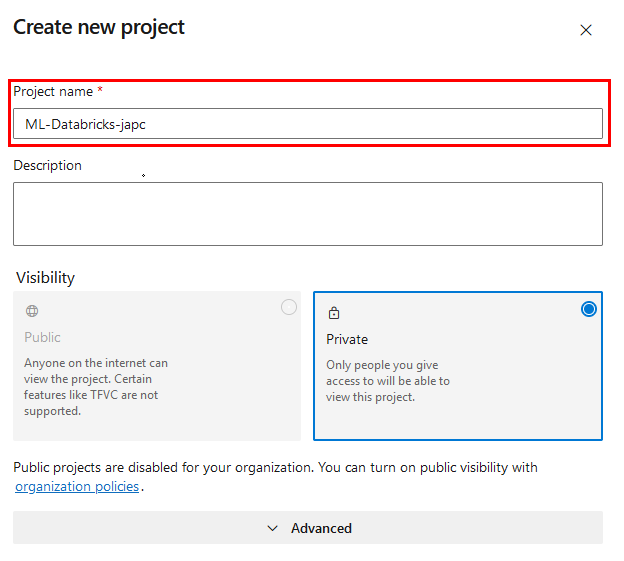

Paso 3. Da clic en el botón **Create**.

Paso 4. Dentro del proyecto, ve a **Repos** y crea un nuevo repositorio.

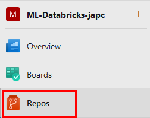

Paso 5. Da clic en **Initialize**

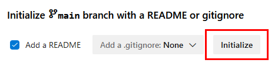

Paso 6. Ahora copia la URL de clonación del repositorio, guardala temporalmente en un bloc de notas.

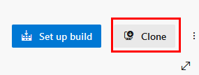
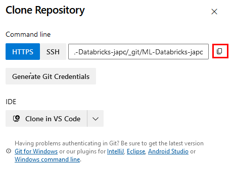

Paso 7. Da clic en ls 3 puntos del repositorio luego selecciona **New** y **Folder**

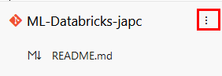

Paso 8. En la ventana emergente escribe **`data`** en la opción **New folder name** y **`README.md`**

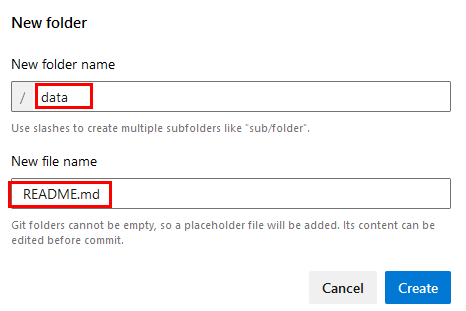

Paso 9. Clic en el botón **Create**.

Paso 10. Ahora da clic en el botón lateral derecho **Commit** y en la venatna emergente has clic en **Commit**.

Paso 11. Descarga el siguiente archivo desde la URL, copiala y pegala en una nueva pestaña de tu navegador.

```
https://s3.us-west-2.amazonaws.com/labs.netec.com/courses/MLOPS_Databricks/V0.0.1/productos.csv
```

Paso 12. Ya descargada, ahora subela a **Azure Repos** da clic en los 3 puntos de la carpeta **data**.

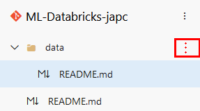

Paso 13. En el menú da clic en la opcion **Upload files(s)**.

Paso 14. En la ventana lateral derecha, busca y carga el archivo **productos.csv** y da clic en el botón **Commit**

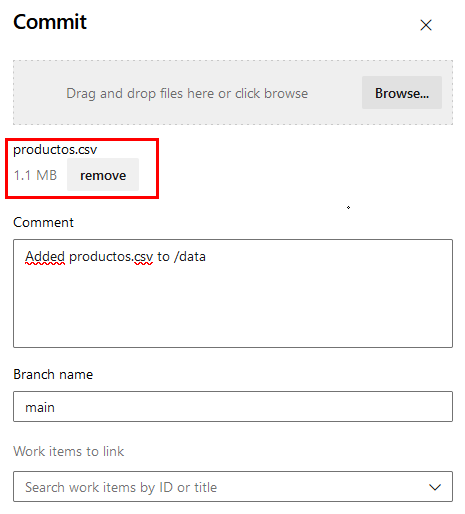

**¡TAREA FINALIZADA!**

El repositorio de Azure DevOps ha sido creado y contiene archivos de ejemplo para el proyecto.

### Tarea 2. Conectar Azure Databricks con el Repositorio de Azure DevOps.

Configurarás la integración de Azure Databricks con el repositorio de Azure DevOps para que el código del proyecto esté disponible en Databricks.

**NOTA IMPORTANTE:** En caso de haber eliminado o cerrado tu workspace. Repite los siguientes pasos para acceder, abre el **Portal de Azure** [**AQUÍ**](https://portal.azure.com).

Resource Groups ---> dbricks-XXXX-### ---> Azure Databricks Service ---> Lunch Workspace ---> Workspace.

**NOTA:** Inicia la maquina virtual en caso de haberla pausado.

Paso 1. En Azure Databricks, selecciona **Workspace** en el menú lateral izquierdo.

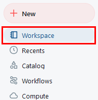

Paso 2. Da clic en el botón **Create** lateral derecho y selecciona **Git folder**

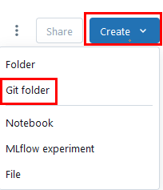

Paso 3. Ingresa la URL de tu repositorio de DevOps que copiaste en tu bloc de notas.

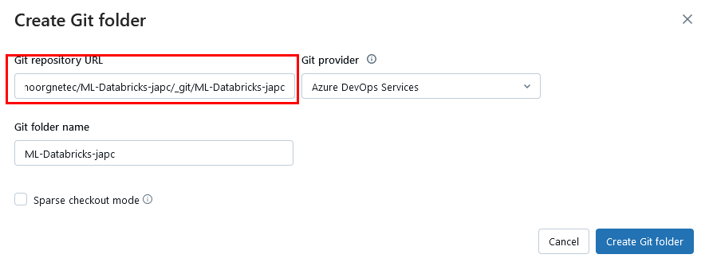

Paso 4. Da clic en el botón **Create Git folder**.

Paso 5. Verifica que los archivos iniciales esten sincronizados.

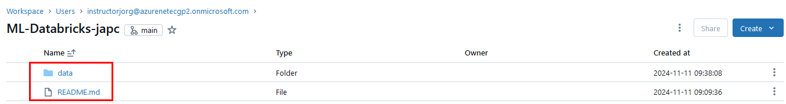

Paso 6. Ahora entra a la carpeta **data** y da clic en los 3 puntos del archivo **productos.csv** ahora clic en **Copy URL/path** finalmente opción **Full path**. Guardala en un bloc de notas.

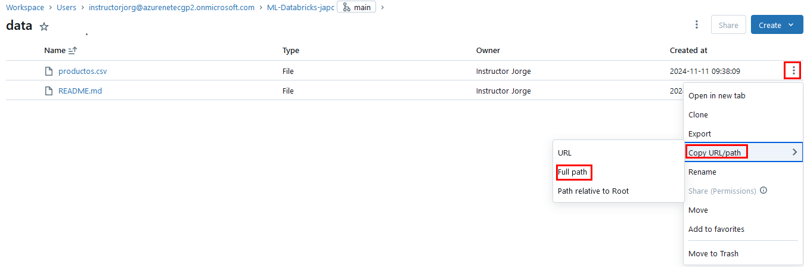

**¡TAREA FINALIZADA!**

Azure Databricks está conectado a tu repositorio de Azure DevOps y listo para trabajar colaborativamente.

### Tarea 3: Crear un Notebook de Entrenamiento de Modelo en Databricks

En esta tarea, crearás un notebook en Azure Databricks para entrenar un modelo de machine learning utilizando los datos de tu repositorio.

Paso 1. Da clic en la opción **Home** luego en el botón **Create** lateral derecho, finalmente selecciona **Notebook**.

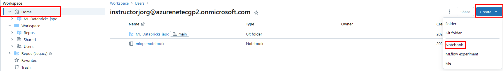

Paso 2. Cambia el nombre del nuevo notebook escribe **`Entrenamiento_Modelo`**

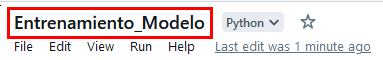

Paso 3. En la primera celda de la libreta, importa las bibliotecas necesarias para procesamiento de datos, como `pyspark.sql` para manipulación de DataFrames.

```
from pyspark.sql import SparkSession
from pyspark.sql.functions import col, regexp_replace, count, when, isnan, round
```

**NOTA:** No habra salida.

Paso 4. Lee el archivo con pandas y luego convertirlo a un DataFrame de Spark. Sustituye la propiedad **TU_FULL_PATH**

```
import pandas as pd

pdf = pd.read_csv("TU_FULL_PATH")

df = spark.createDataFrame(pdf)
df.show(5)
```

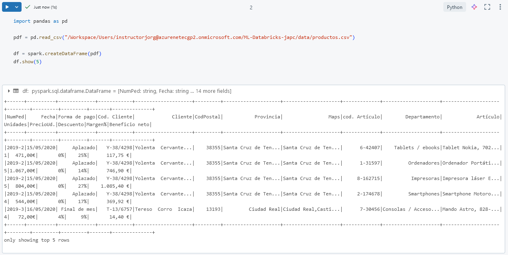

Paso 5. Copia manualmente el archivo al sistema **dbfs:** para facilitar el acceso con Spark. Escribe el siguiente codigo

```
dbutils.fs.cp("file:TU_FULL_PATH", "dbfs:/data/productos.csv")
```

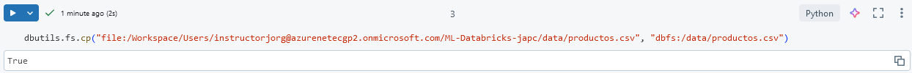

**NOTA:** En general, es una buena práctica almacenar los datos en DBFS (Databricks File System) cuando trabajas en Databricks.

- Acceso Eficiente y Consistente.
- Persistencia
- Escalabilidad
- Mantenimiento y Organización

Paso 6. Ahora verifica el acceso correcto a los datos. Escribe el siguiente comando.

```
data_path = "dbfs:/data/productos.csv"
df = spark.read.csv(data_path, header=True, inferSchema=True, sep=",")
df.show(5)
```

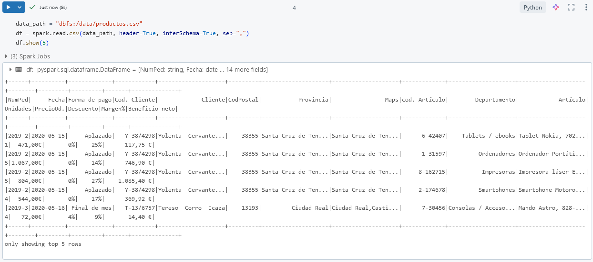

Paso 7. Limpia y convierte las columnas necesarias, como la eliminación de caracteres de moneda en `PrecioUd.` y `Beneficio neto`.

```
df = df.withColumn("PrecioUd", regexp_replace(regexp_replace(regexp_replace(col("`PrecioUd.`"), "€", ""), "\\.", ""), ",", ".").cast("double"))
df = df.withColumn("Beneficio_neto", regexp_replace(regexp_replace(regexp_replace(col("`Beneficio neto`"), "€", ""), "\\.", ""), ",", ".").cast("double"))
df.show(5)
```

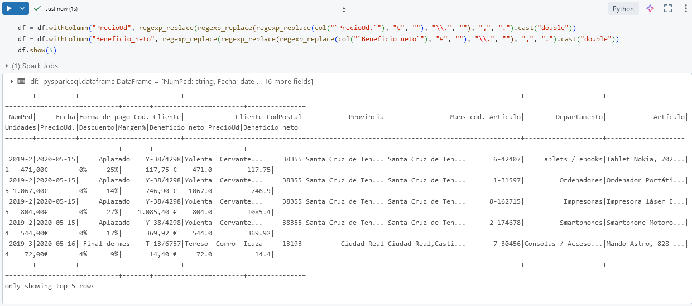

Paso 8. Verifica que no haya quedado algun campo **NULL** de los previamente convertidos.

```
df.select(
    count(when(col("PrecioUd").isNull(), "PrecioUd")).alias("PrecioUd_NULLs"),
    count(when(col("Beneficio_neto").isNull(), "Beneficio_neto_NULLs"))
).show()
```

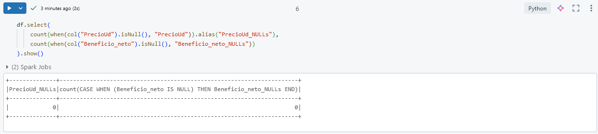

Paso 9. Agrega una nueva columna `PrecioUsd` para convertir `PrecioUd` de euros a dólares (asumiendo una tasa de cambio de 1.1 USD por 1 EUR).

```
tasa_cambio = 1.07
df = df.withColumn("PrecioUsd", col("`PrecioUd`") * tasa_cambio)
df.show(5)
```

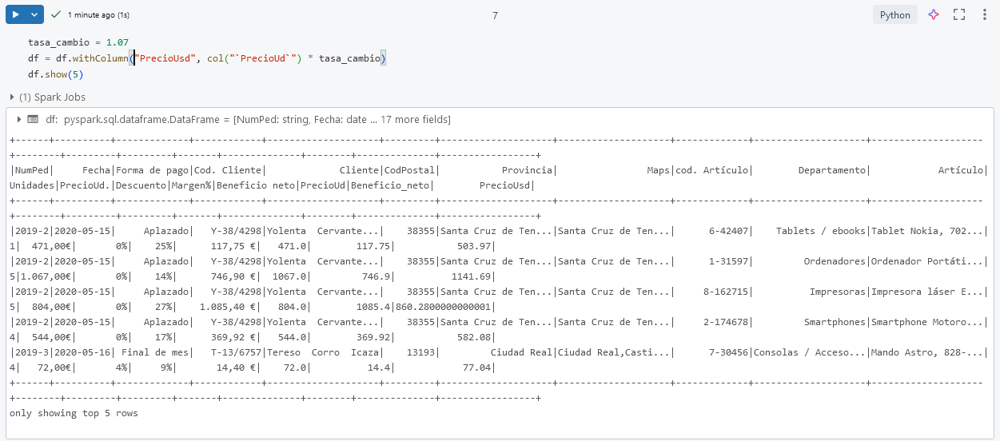

**NOTA:** Puede haber variaciones en la tasa de cambio.

Paso 10. Por ultimo ajusta los decimales a que solo muestren 2.

```
df = df.withColumn("PrecioUsd", round(col("PrecioUsd"), 2))
df = df.withColumn("Beneficio_neto", round(col("Beneficio_neto"), 2))
df.show(5)
```

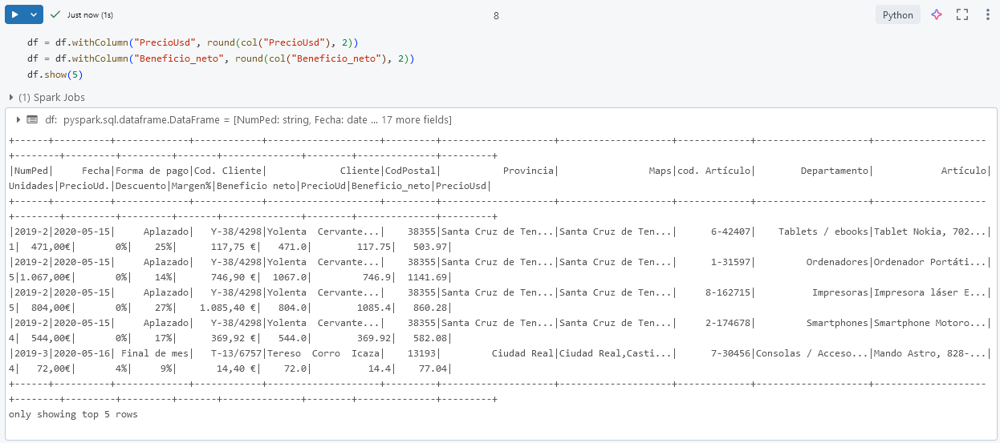

**¡TAREA FINALIZADA!**

El notebook de procesamiento de datos está listo en Databricks, con el código para cargar, limpiar, y estandarizar precios en dólares.

**¡LABORATORIO FINALIZADO!**

### Resultado esperado

Al finalizar este laboratorio, habrás integrado Azure Databricks con Azure DevOps, colaborado en un proyecto de Machine Learning con control de versiones.


---

**[⬅️ Atrás](/Capítulo3/lab3.md)** | **[Lista General](/README.md)** | **[Siguiente ➡️](/Capítulo5/lab5.md)**

---
