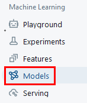
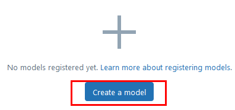

# Laboratorio 5. Entrenamiento y evaluación de modelos 

## Objetivo de la práctica:

Al finalizar la práctica, serás capaz de:

- Entrenar y registrar dos versiones de un modelo de machine learning utilizando datos de ventas.
- Evaluar y comparar el rendimiento de ambas versiones con métricas de regresión.
- Guardar los modelos y los resultados para análisis y comparación.

## Duración aproximada:
- 30 minutos.

---

**[⬅️ Atrás](/Capítulo4/lab4.md)** | **[Lista General](/README.md)** | **[Siguiente ➡️](/Capítulo6/lab6.md)**

---

## Instrucciones 

### Tarea 1. Preparar el Dataset para el Entrenamiento

Configurarás un pipeline de machine learning para entrenar un modelo de regresión que prediga el beneficio neto en función del precio en dólares y las unidades vendidas.

**NOTA:** Esta práctica es continuación del **Laboratorio 4** usaras la misma libreta. 

Paso 1. Asegurate de estar en la libreta **Entrenamiento_Modelo** al final de todas las celdas agrega una nueva.


Paso 2. Selecciona las columnas necesarias para el modelo, tales como `PrecioUsd`, `Unidades` y `Beneficio_neto`.

```
df_ml = df
df_ml.show(5)

df_ml = df.select("PrecioUsd", "Unidades", "Beneficio_neto")
df_ml.show(5)
```


**TAREA FINALIZADA**

El dataset está listo para el entrenamiento de los modelos con las columnas seleccionadas y limpiadas.

### Tarea 2. Entrenar y Registrar la Primera Versión del Modelo

En esta tarea, configuraras un experimento en Databricks MLflow y entrenaras la primera versión del modelo, registrando las métricas y parámetros.

Paso 1. Entrenarás la primera versión del modelo y registrarás sus métricas para comparaciones futuras.

```
from pyspark.ml.feature import VectorAssembler

if "features" in df_ml.columns:
    df_ml = df_ml.drop("features")

assembler = VectorAssembler(inputCols=["PrecioUsd", "Unidades"], outputCol="features")
df_ml = assembler.transform(df_ml)
df_ml.show(5)
```


Paso 2. Entrena la primera versión del modelo de regresión lineal.

```
from pyspark.ml.feature import VectorAssembler
from pyspark.ml.regression import LinearRegression
import mlflow

with mlflow.start_run(run_name="Modelo_V1"):
    lr_v1 = LinearRegression(labelCol="Beneficio_neto", featuresCol="features")
    model_v1 = lr_v1.fit(df_ml)

    mlflow.log_param("regParam", lr_v1.getRegParam())
    mlflow.log_param("elasticNetParam", lr_v1.getElasticNetParam())

    training_summary = model_v1.summary
    mlflow.log_metric("RMSE", training_summary.rootMeanSquaredError)
    mlflow.log_metric("R2", training_summary.r2)

    mlflow.spark.log_model(model_v1, "model")
```


**NOTA:** El proceso tardara unos segundos.

**IMPORTANTE:** Recuerda que tambien puedes verificar el experimento en la interfaz grafica de Databricks. Seleccionando **Experiments** en el menu lateral izquierdo.

**TAREA FINALIZADA**

La primera versión del modelo ha sido entrenada y registrada como un experimento en Databricks MLflow.

### Tarea 3: Entrenar y Registrar la Segunda Versión del Modelo con Parámetros Diferentes.

Entrenarás una segunda versión del modelo ajustando parámetros adicionales y registrarás sus métricas para comparación en el mismo experimento.

Paso 1. Entrena la segunda versión del modelo dentro del contexto de MLflow y ajusta el parámetro `regParam` para aplicar regularización.

**NOTA:** Al establecer regParam=0.1, se incorpora una regularización ligera. Basado en **L2 regularización (Ridge)** o **L1 regularización (Lasso)**

```
with mlflow.start_run(run_name="Modelo_V2"):
    lr_v2 = LinearRegression(labelCol="Beneficio_neto", featuresCol="features", regParam=0.1)
    model_v2 = lr_v2.fit(df_ml)

    mlflow.log_param("regParam", lr_v2.getRegParam())
    mlflow.log_param("elasticNetParam", lr_v2.getElasticNetParam())

    training_summary_v2 = model_v2.summary
    mlflow.log_metric("RMSE", training_summary_v2.rootMeanSquaredError)
    mlflow.log_metric("R2", training_summary_v2.r2)

    mlflow.spark.log_model(model_v2, "model")
```


**TAREA FINALIZADA**

La segunda versión del modelo ha sido entrenada con regularización y registrada en MLflow para comparación en el mismo experimento.

### Tarea 4: Comparar las Métricas de las Versiones del Modelo en Experiments

En esta tarea, utilizarás la interfaz de Databricks Experiments para visualizar y comparar las métricas de ambas versiones del modelo.

Paso 1. Dirígete a la sección de **Experiments** en Databricks y selecciona el experimento `Modelo_Versiones`.


Paso 2. Dentro del experimento llamado **Entrenamiento_Modelo**, compara las métricas registradas de `RMSE` y `R2` entre las dos versiones. Puedes ordenar las versiones por cada métrica para determinar cuál es la más eficiente.


Paso 3. Selecciona los 2 modelos creados y da clic en el botón **Compare**


Paso 4. Compara las estadisticas de ambos modelos.

- **R2:** Un R² más cercano a 1 indica un mejor ajuste del modelo. Sin embargo, un valor bajo de R² no siempre significa que el modelo sea malo, especialmente en problemas complejos.

- **RMSE:**  Valores más bajos indican un mejor ajuste, ya que implican menor cantidad de errores.


Paso 5. Puedes tambien dar clic en el nombre de la metrica **R2** por ejemplo y ver las estadisticas en una grafica.


Paso 6. Repite el paso 5 y visualiza la metrica **RMSE**.


**TAREA FINALIZADA**

Las métricas de ambas versiones del modelo han sido comparadas usando la interfaz de Experiments de Databricks.

### Tarea 5: Registrar y Versionar los Modelos en Databricks Models

En esta tarea, registrarás las dos versiones del modelo en la sección de **Models** de Databricks para su almacenamiento, versionamiento y futura implementación.

Paso 1. Dirígete a la sección de **Models** en Databricks.



Paso 2. Da clic en el botón **Create a model**  y crea un nuevo registro de modelo llamado `Modelo_Prediccion_Beneficio`.




Paso 3. Clic en el botón **Create**.

Paso 4. Asocia las dos versiones del modelo almacenadas en MLflow al registro `Modelo_Prediccion_Beneficio`:

   - **Versión 1**: Selecciona el experimento de la primera ejecución y asígnalo como la **Versión 1** del modelo.
   - **Versión 2**: Selecciona el experimento de la segunda ejecución y asígnalo como la **Versión 2** del modelo.

Paso 5. Regresa a tu libreta busca la celda de la ejecución del primer modelo **Modelo_v1** y en la salida copia el **run_id**.


Paso 6. Agrega una nueva celda hasta el final. Copia y pega el siguiente codigo para registrar el modelo. Sustituye el valor de **TU_RUN_ID**

```
import mlflow
from mlflow.tracking import MlflowClient

model_registry_name = "Modelo_Prediccion_Beneficio"

run_id = "TU_RUN_ID"

model_uri = f"runs:/{run_id}/model"

mlflow.register_model(model_uri, model_registry_name)

print(f"Modelo registrado en el Model Registry con el nombre: {model_registry_name}")
```


Paso 7. Repite el paso 5 pero ahora busca la celda que contiene **Modelo_v2**.


Paso 8. Repite el paso 6. Copia y pega el codigo para registrar el segundo modelo. Sustituye el valor de **TU_RUN_ID** (Modelo 2)

```
import mlflow
from mlflow.tracking import MlflowClient

model_registry_name = "Modelo_Prediccion_Beneficio"

run_id = "TU_RUN_ID"

model_uri = f"runs:/{run_id}/model"

mlflow.register_model(model_uri, model_registry_name)

print(f"Modelo registrado en el Model Registry con el nombre: {model_registry_name}")
```


Paso 9. Regresa a la sección de **Models** da clic en el modelo creado previamente **Modelo_Predicción_Beneficio** y revisa que esten las 2 versiones.


Paso 10. Por ultimo, de vuelta a tu libreta, agrega una celda mas hasta el final. Agrega el siguiente codigo. Se visualizaran graficas con la libreria **Matplotlib**

```
import matplotlib.pyplot as plt

metrics_data = {
    "Versión": ["V1", "V2"],
    "RMSE": [training_summary.rootMeanSquaredError, training_summary_v2.rootMeanSquaredError],
    "R2": [training_summary.r2, training_summary_v2.r2]
    }

plt.figure(figsize=(10, 6))
plt.bar(metrics_data["Versión"], metrics_data["RMSE"], color='skyblue', label='RMSE')
plt.bar(metrics_data["Versión"], metrics_data["R2"], color='lightgreen', label='R2', bottom=metrics_data["RMSE"])
plt.title("Comparación de Métricas entre Versiones del Modelo")
plt.ylabel("Valor de Métrica")
plt.legend()
plt.show()
```


**TAREA FINALIZADA**

Ambas versiones del modelo han sido registradas y versionadas en Databricks Models para su comparación y análisis futuro.

**¡LABORATORIO FINALIZADO!**

### Resultado esperado

Al finalizar este laboratorio, habrás aprendido a entrenar y registrar dos versiones de un modelo de machine learning utilizando MLflow en Databricks, comparar el rendimiento en Experiments, y versionar los modelos en Models para su almacenamiento y uso futuro.


---

**[⬅️ Atrás](/Capítulo4/lab4.md)** | **[Lista General](/README.md)** | **[Siguiente ➡️](/Capítulo6/lab6.md)**

---