# Laboratorio 7. Configuración del entorno de desarrollo en Azure

## Objetivo de la práctica:

Al finalizar la práctica, serás capaz de:

- Configurar un nuevo proyecto en Azure Machine Learning Studio.
- Preparar el entorno para un modelo.

## **Objetivo Visual:**

Realizarás la creación de un Workspace de Azure Machine Learning Studio y se dará de alta una libreta de Jupyter para la validación del ambiente.

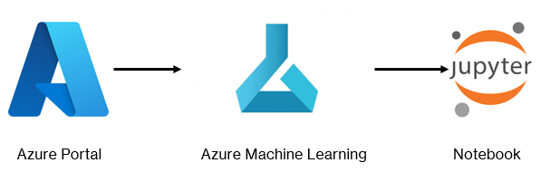

## **Duración aproximada:**

- 50 minutos.

---

**[⬅️ Atrás](https://netec-mx.github.io/MLOPS-DATABRI/Cap%C3%ADtulo5/lab5.html)** | **[Lista General](https://netec-mx.github.io/MLOPS-DATABRI/)** | **[Siguiente ➡️](https://netec-mx.github.io/MLOPS-DATABRI/Cap%C3%ADtulo6/README_6.2.html)**

---

## Prerrequisitos:

- Tener una cuenta activa en Azure.
- Acceso a Azure Machine Learning Studio (puedes obtener una prueba gratuita si es necesario).

## Instrucciones:

### **Tarea 1. Acceso al portal de Azure.**

En esta tarea, realiza la autenticación en el portal de Azure.

Paso 1. Abre tu navegador web favorito (de preferencia **Google Chrome**).

Paso 2. Navega a la página principal de Azure Portal: [Azure Portal](https://portal.azure.com/).

Paso 3. Si ya tienes una cuenta de Azure, ingresa tu **dirección de correo electrónico y contraseña asociada**.

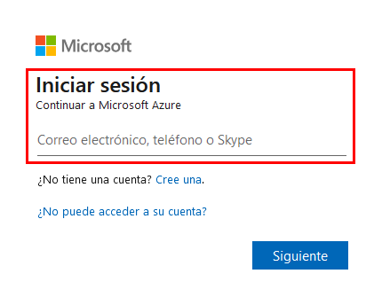

Paso 4. Si aún no tienes una cuenta, haz clic en **"Cree una"** y sigue las instrucciones para crearla. A todo esto, necesitas una tarjeta de crédito para la verificación, pero **no se se realizará el cobro** durante el período de prueba.

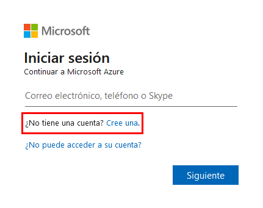

Paso 5. Es posible que te solicite realizar una verificación de seguridad adicional, ya sea un código enviado a tu correo electrónico o a tu teléfono. Sigue las instrucciones en pantalla para completar este proceso.

Paso 6. Una vez iniciada sesión o creada tu cuenta, accede a la interfaz del portal de Azure.

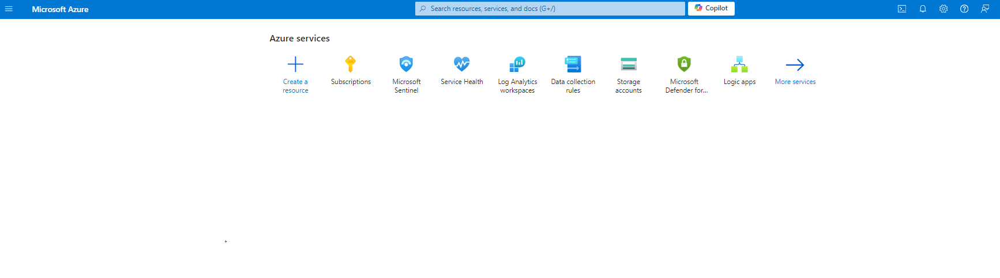

**¡TAREA FINALIZADA!**

Has completado la autenticación a tu cuenta de Azure.

### **Tarea 2. Creación de Azure Machine Learning Studio.**

En esta tarea, crea el ambiente de Azure Machine Learning Studio para el entrenamiento e implementación.

Paso 1. Ahora, en la parte superior central del portal, haz clic en el buscador y escribe: **`Azure Machine Learning`**.

Paso 2. Selecciona el servicio como lo muestra la imagen siguiente:

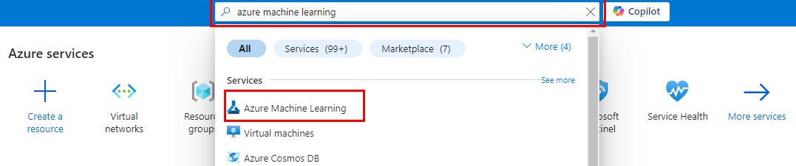

Paso 3. Dentro de la **interfaz de Azure Machine Learning**, haz clic en el botón **`+ Create`** y selecciona la opción **`New Workspace`**. Puedes guiarte de la siguiente imagen:

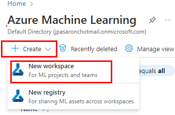

Paso 4. A continuación, realiza la configuración mínima válida para el workspace y laboratorio.

| Parámetro       | Valores |
|-----------------|---------|
| Subscription    | Selecciona la **suscripción** de tu cuenta o la que se asignó para el curso. |
| Resource Group  | Crea uno nuevo con el nombre **mlrg-XXXX**. Sustituye las **X** por las iniciales de tu nombre. |
| Name            | **mldata-workspace-XXXX**. Sustituye las **X** por las iniciales de tu nombre. |
| Region          | **Asignada en el curso**.  |

**IMPORTANTE:** El resto de los valores se quedarán por defecto.

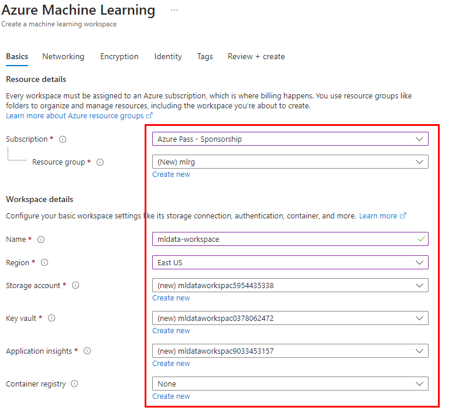

Paso 5. Da clic en el botón inferior izquierdo llamado **`Review + create`**. Esto iniciará un proceso de validación de la configuración definida.

Paso 6. Finalmente, haz clic en el botón **`Create`**.

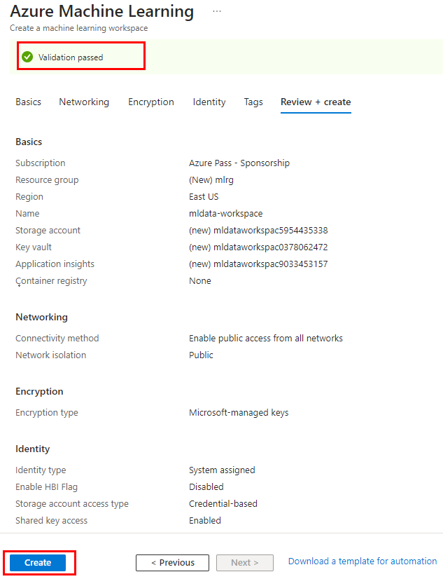

**NOTA:** Aproximadamente, el proceso de creación puede durar de **1:30 a 2 minutos**.

Paso 7. Una vez creado, haz clic en el botón **`Go to resource`**.

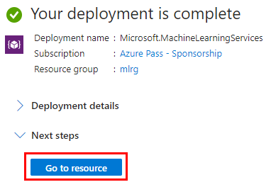

Paso 8. Dentro de la página principal de **Azure Machine Learning Workspace**, haz clic en el botón **`Launch studio`**.

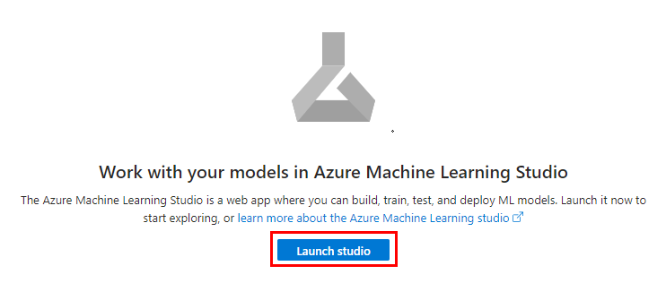

Paso 9. Ahora estarás dentro de la página principal de **Machine Learning Studio**. Puedes explorar algunas opciones, tales como las de la siguiente tabla:

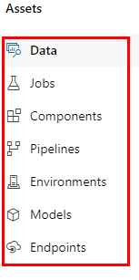

| Parámetro       | Valores |
|-----------------|---------|
| Data            | Para gestionar y explorar los datos que usarás en tus experimentos. |
| Jobs            | Donde puedes crear y ejecutar tus experimentos de Machine Learning. |
| Components      | Registra tu código desde GitHub, AzureDevOps o archivos locales para crear componentes compartibles. |
| Pipelines       | Para crear y gestionar flujos de trabajo de Machine Learning. |
| Environments    | Los entornos curados son entornos predefinidos que ofrecen buenos puntos de partida para construir tus propios entornos. |
| Models          | Para ver y gestionar los modelos que has entrenado. |
| Endpoints       | Los puntos finales en tiempo real contienen implementaciones que están listas para recibir datos de clientes y pueden enviar respuestas de inmediato. |

**¡TAREA FINALIZADA!**

Has completado la creación de tu Workspace en Azure Machine Learning.

### **Tarea 3. Implementación de un modelo de entrenamiento.**

En esta tarea se entrenará e implementará un modelo para validar que el entorno de **Machine Learning Studio** haya sido creado correctamente.

Paso 1. Dentro de la página principal del Studio de ML, selecciona la libreta de ejemplo llamada **Get Started: Train and deploy a model** y haz clic en el botón **`Start`**.

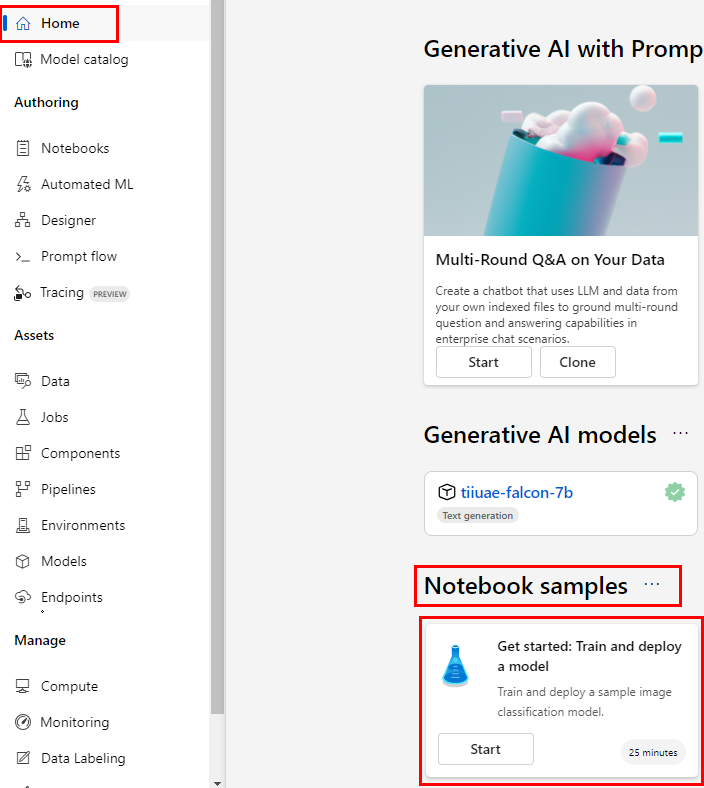

Paso 2. Una vez abierta la libreta, haz clic en el botón **`Clone this notebook`** para agregarla a tu workspace.

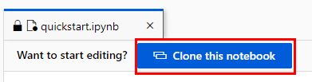

Paso 3. Se abrirá una ventana emergente donde confirmarás la clonación dando clic en el botón **`Clone`**.

**NOTE:** El proceso de clonación puede durar de **30 a 50 segundos** aproximadamente.

Paso 4. Una vez clonado el proyecto, observa en la parte izquierda el árbol de archivos para el entrenamiento.

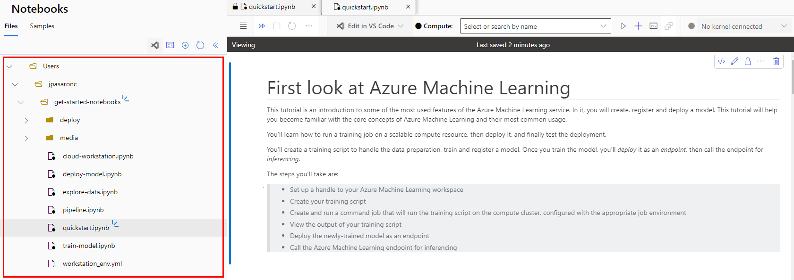

Paso 5. En la parte central pueder ver el título de la libreta llamada **First look at Azure Machine Learning**.

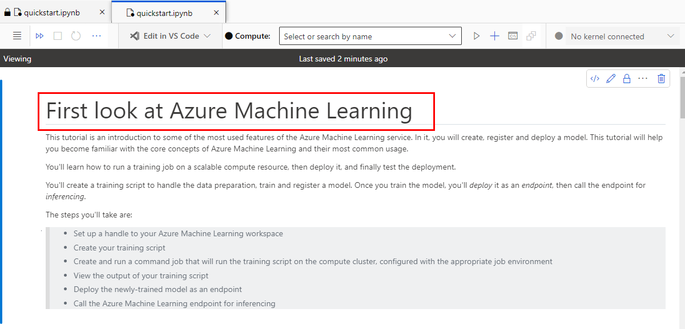

Paso 6. A partir de este momento, el **resto del laboratorio** lo realizarás con las **instrucciones de la libreta** en el Estudio de Azure ML.

Paso 7. Clic en el símbolo **+** para la creación del ambiente de computo.

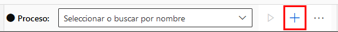

Paso 8. En la creación de la **Máquina Virtual de Cómputo**, cambia los siguientes valores:

| Parámetro       | Valores |
|-----------------|---------|
| Compute Name    | **mlcompute-sXXXX** Cambia las **"X"** por las iniciales de tu nombre. |
| Virtual Machine Size | **Standard_DS11_v2** En caso de no estar disponible se puede seleccionar otra **Standard_DS3_v2**|

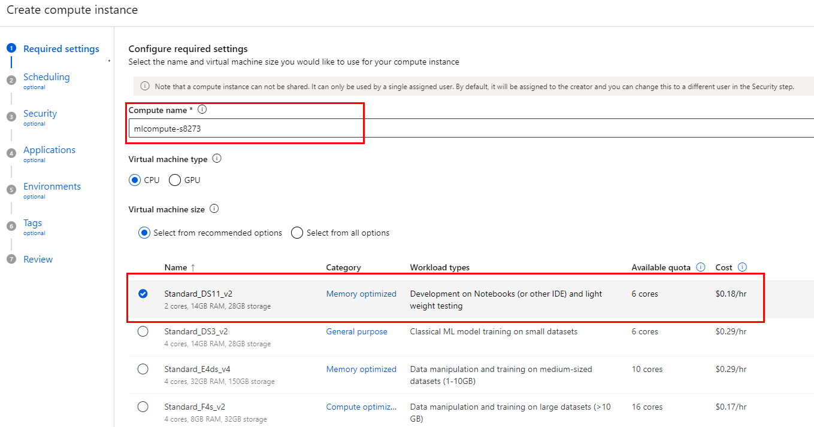

Paso 9. Ahora, da clic en la opción **`Scheduling`** para ajustar el tiempo de inactividad de la Máquina de Cómputo a **60 minutos** y haz clic en el botón **`Review + create`**.

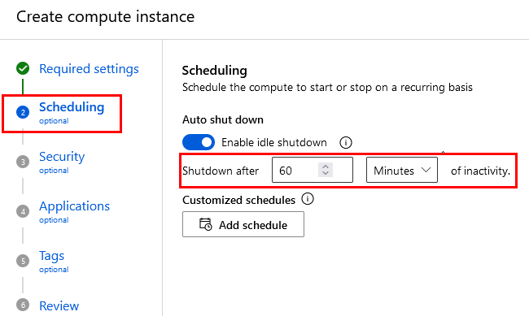

**NOTA:** El resto de las configuraciones se quedarán por defecto.

Paso 10. Finalmente, haz clic en el botón **`Create`** de la sección **Review**.

**NOTA:** El tiempo aproximado de creación es de **2:20 a 2:30 minutos**. Espera a que esté en el estado **Running** antes de continuar.

**IMPORTANTE:** En la sección **Submit the job**, puede tardar **3 minutos** en iniciar el Job y, en completar, puede tardar **2:50 minutos** aproximadamente.

**IMPORTANTE:** En la sección **Create a new online endpoint** puede tardar un alrededor de **2 minutos** en crear el endpoint.

**ATENCIÓN:** Si te marca un error **`(SubscriptionNotRegistered) Resource provider [N/A] isn't registered with Subscription [N/A]`**, registra el Resource Provider en la suscripción llamado **`Microsoft.Cdn`**.

**IMPORTANTE:** En la sección **Deploy the model to the endpoint** puede tardar entre **6 a 8 minutos** para realizar la implementación.

**IMPORTANTE:** En caso de que te marque un error por el tipo de la máquina virtual, puedes cambiar el valor de la **línea 12** y usar este tipo: **Standard_DS1_v2**. Al ser un servidor más pequeño, el tiempo de implementación puede ser de **9:30 a 10 minutos**.

**PELIGRO:** No olvides eliminar el endpoint al final de la libreta.

**¡TAREA FINALIZADA!**

Has completado de interactuar con la primera libreta en Azure Machine Learning Studio.

**¡LABORATORIO FINALIZADO!**

### Resultado esperado:

El resultado debe ser la ejecución de todas las celdas sin errores.

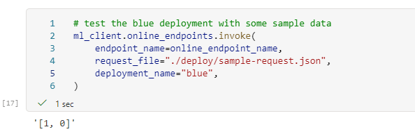

---

**[⬅️ Atrás](https://netec-mx.github.io/MLOPS-DATABRI/Cap%C3%ADtulo5/lab5.html)** | **[Lista General](https://netec-mx.github.io/MLOPS-DATABRI/)** | **[Siguiente ➡️](https://netec-mx.github.io/MLOPS-DATABRI/Cap%C3%ADtulo6/README_6.2.html)**

---
