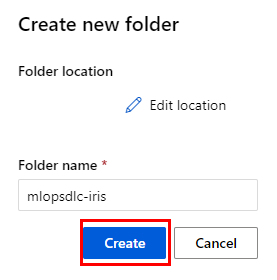

# Laboratorio 8. Ciclo de Vida de MLOps

## Objetivo de la práctica:

Al finalizar la práctica, serás capaz de:

- Implementar un flujo de trabajo completo de MLOps utilizando Azure Machine Learning y Jupyter Notebooks.

## Objetivo Visual:

Fases del ciclo de vida de Machine Learning.


## Duración aproximada:

- 50 minutos.

---

**[⬅️ Atrás](https://netec-mx.github.io/MLOPS-DATABRI/Cap%C3%ADtulo6/README_6.1.html)** | **[Lista General](https://netec-mx.github.io/MLOPS-DATABRI/)** | **[Siguiente ➡️](https://netec-mx.github.io/MLOPS-DATABRI/Cap%C3%ADtulo7/README_7.1.html)**

---

## **Prerrequisitos:**

- Tener una cuenta activa en Azure.
- Conocimientos básicos en Python y Machine Learning.
- Familiaridad con Jupyter Notebooks y Azure Portal.

## Instrucciones:

### **FASE 1: PLANIFICACIÓN DEL MODELO.**

- Objetivo: Predecir la especie de flores iris utilizando el dataset iris.

**FASE 1: RECOLECCIÓN DE DATOS ¡FINALIZADA!**

### **FASE 2: RECOLECCIÓN DE DATOS**

- Objetivo: Usar el dataset iris disponible en `sklearn.datasets`.

### Tarea 1. Creación de un contenedor en Azure Storage Account.

Paso 1.  Para iniciar, abre tu Portal de Azure en este **[enlace](https://portal.azure.com/)**.

Paso 2.  Busca el servicio de **`Azure Storage Account`** en la parte superior central del portal y haz clic en **`Storage accounts`**.


Paso 3.  En la parte superior izquierda, haz clic en el botón **`Create`**.

Paso 4.  En la página de creación del Storage Account, define los siguientes valores; puedes guiarte de la imagen:

| Parámetro       | Valores |
|-----------------|---------|
| Subscription    | Selecciona la **suscripción** de tu cuenta o la que se asignó para el curso. |
| Resource Group  | Selecciona el grupo existente **mlrg-XXXX**. |
| Name            | **mldataworkspaceXXXX** Sustituye las **"X"** por valores aleatorios. |
| Region          | **East US** |
| Redundancy | Locally-redundant storage (LRS) |


**IMPORTANTE:** El resto de los valores se quedarán por defecto.**

Paso 5.  Haz clic en el botón **`Review + create`**.

Paso 6.  Ahora, da clic en el botón **`Create`**.

**NOTA:** El proceso de creación puede durar un par de minutos. Espera a que se complete la creación del servicio.

Mientras tanto, puedes ver la **[Introducción a Azure Storage](https://learn.microsoft.com/en-us/azure/storage/common/storage-introduction?toc=%2Fazure%2Fstorage%2Fblobs%2Ftoc.json)**.

Paso 7.  Una vez creado, haz clic en el botón **`Go to resource`**.

Paso 8.  Recolecta la cadena de conexión del **storage account** para realizar la **autenticación** más adelante.


**NOTA:** Guárdala en un bloc de notas temporalmente en tu computadora.

Paso 9.  Para el siguiente paso, haz clic en la sección **`Containers`** y crea un contenedor llamado **dataml**.


Paso 10. Haz clic en el botón **`Create`**.

**¡TAREA FINALIZADA!**

Has completado la tarea de creación de un Storage Account.

### Tarea 2. Abrir ML Workspace y crear un Jupyter Notebook.

Paso 1. Nuevamente, en el buscador del portal de Azure, escribe **`Azure Machine Learning`** y haz clic en el servicio.

Paso 2. Reutiliza el **workspace** creado en el Laboratorio 6.1. Haz clic en el nombre.

Paso 3. En la pantalla principal, haz clic en el botón **`Launch Studio`**.

Paso 4. Dentro de la página principal de tu **ML Workspace**, haz clic en la sección lateral derecha **`Notebooks`**, debajo de **Authoring**.

Paso 5. Ahora, haz clic en la opción **`Files`** y después en **`Create a new folder`**.



Paso 6. En la ventana emergente, coloca el nombre **`mlopsdlc-iris`** y haz clic en **`Create`**.

Paso 7. ¡Bien! Una vez que la carpeta ha sido la carpeta creada, pasa el puntero sobre la carpeta y se habilitarán tres puntos al costado derecho. Haz clic para abrir el menú y selecciona **`Create new file`**.


Paso 8. En la ventana emergente, define el nombre de la libreta como **`irisnotebook.ipynb`** y asegúrate de que sea de tipo **Notebook**.

Paso 9. Haz clic en el botón **`Create`**.

**NOTA:** Ahora carga el código que recolectará los datos.

Paso 10. En la primera celda de tu libreta de Jupyter, agrega el siguiente código cambia el **connection_string** en la **línea 7** por el valor de tu bloc de notas:

```
import os
import pandas as pd
import requests
from azure.storage.blob import BlobServiceClient

# Configuración de Azure Blob Storage
connection_string = "<tu_connection_string>"
container_name = "dataml"
upload_blob_name = "iris.csv"
local_file_path = "data/iris.csv"

# URL del dataset de Iris
dataset_url = "https://archive.ics.uci.edu/ml/machine-learning-databases/iris/iris.data"

# Descargar el archivo CSV desde la URL
def download_dataset():
    print("Descargando archivo desde la URL...")
    response = requests.get(dataset_url)
    response.raise_for_status()  # Verifica que la solicitud fue exitosa

    # Crear la carpeta 'data' si no existe
    os.makedirs(os.path.dirname(local_file_path), exist_ok=True)
    
    # Guardar el archivo CSV localmente
    with open(local_file_path, "wb") as file:
        file.write(response.content)
    print(f"Archivo descargado en {local_file_path}")

# Agregar encabezados al archivo CSV
def add_headers_and_upload():
    # Leer el archivo CSV descargado
    df = pd.read_csv(local_file_path, header=None)
    
    # Encabezados para el dataset de Iris
    headers = ["sepal_length", "sepal_width", "petal_length", "petal_width", "species"]
    df.columns = headers
    
    # Guardar el DataFrame con encabezados en el archivo final
    df.to_csv(local_file_path, index=False)
    print(f"Archivo con encabezados guardado en {local_file_path}")
    
    # Subir el archivo con encabezados a Blob Storage
    blob_service_client = BlobServiceClient.from_connection_string(connection_string)
    blob_client = blob_service_client.get_blob_client(container=container_name, blob=upload_blob_name)
    with open(local_file_path, "rb") as data:
        blob_client.upload_blob(data, overwrite=True)
    print(f"Archivo {local_file_path} subido a Blob Storage como {upload_blob_name}")

# Ejecutar las funciones
download_dataset()
add_headers_and_upload()
```

Paso 11. Para ejecutar la celda, da clic en el botón de **`Play`**.


**IMPORTANTE:** El código viene documentado con comentarios. Pero, a grandes rasgos, descargamos la fuente de datos, se ajustan los encabezados y se respalda la información en el Storage Account.

**IMPORTANTE:** En caso de que el código no corra, asegúrate de tener un ambiente de cómputo, recuerda los pasos del Laboratorio 1.1. para crearlo.

### Resultado esperado:


**¡TAREA FINALIZADA!**

Has completado la recolección de datos.

**FASE 2: RECOLECCIÓN DE DATOS ¡FINALIZADA!**

### **FASE 3: PREPROCESAMIENTO DE DATOS.**

### Tarea 1. Definición de código para preprocesar datos.

En esta tarea, procesarás la informacion del dataset iris para el entrenamiento.

Paso 1. Agrega otra celda más para definir el código que preprocesará el archivo `iris.csv`. Pasa el puntero sobre el resultado de la celda anterior y, en el cuadro rojo de la imagen, se habilitará la opción **Code** para agregar una celda de código.


Paso 2. Agrega el siguiente código para el preprocesamiento:

```
import pandas as pd
import os

input_path = 'data/iris.csv'
output_path = 'preprocessed_data'

def preprocess_data(input_path, output_path):
    # Crear el directorio si no existe
    if not os.path.exists(output_path):
        os.makedirs(output_path)
    
    # Verificar si el archivo de entrada existe
    if not os.path.exists(input_path):
        raise FileNotFoundError(f"El archivo de entrada {input_path} no existe.")
    
    # Cargar los datos
    data = pd.read_csv(input_path)
    
    # Verificar la carga de datos
    if data.empty:
        raise ValueError(f"El archivo {input_path} está vacío.")
    
    # Procesamiento de datos (ajusta esto según tus necesidades)
    X = data.drop('species', axis=1)
    y = data['species']
    
    # Verificar los datos procesados
    if X.empty or y.empty:
        raise ValueError("Los datos procesados están vacíos.")
    
    # Guardar los datos procesados
    X.to_csv(os.path.join(output_path, 'X_train.csv'), index=False)
    y.to_csv(os.path.join(output_path, 'y_train.csv'), index=False)
    
    print(f"Datos preprocesados y guardados en {output_path}")

preprocess_data(input_path, output_path)
```

**NOTA:** El código realizará la obtención de los datos, omitirá la columna de **Species** y dividirá la información en los archivos de entrenamiento.

Paso 3. Ejecuta la celda con el código.

**NOTA:** El proceso tardará un par de segundos.

Paso 4. Si todo sale bien, el resultado será como en la siguiente imagen:


Paso 5. Adicionalmente, puedes observar en el árbol de directorios y archivos lateral izquierdo una nueva carpeta llamada **preprocessed_data** con el contenido procesado.


**NOTA:** Hasta ahora vas bien; llevas tres fases del ciclo de vida de Machine Learning.

**¡TAREA FINALIZADA!**

Has completado el procesamiento de datos.

**FASE 3: PREPROCESAMIENTO DE DATOS ¡FINALIZADA!**

### **FASE 4: ENTRENAMIENTO DEL MODELO.**

### Tarea 1. Definición de código para entrenar el modelo.

En esta tarea se realizara el entrenamiento del modelo.

Paso 1.  En este punto, repite la estructura del procesamiento de datos, pero con el código para entrenar el modelo.

Paso 2.  **Agrega otra celda** como lo hiciste en la tarea anterior, debajo del **Preprocesamiento**.

Paso 3.  Ahora, agrega el siguiente bloque de código que entrenará la información:

```
import os
import pandas as pd
import joblib
from sklearn.ensemble import RandomForestClassifier

# Crear la carpeta 'outputs' si no existe
os.makedirs('outputs', exist_ok=True)

# Cargar los datos preprocesados
X_train = pd.read_csv('preprocessed_data/X_train.csv')
y_train = pd.read_csv('preprocessed_data/y_train.csv').values.ravel()

# Verificar la carga de datos
if X_train.empty or y_train.size == 0:
    raise ValueError("Los datos de entrenamiento están vacíos.")

# Entrenar el modelo
model = RandomForestClassifier(n_estimators=100)
model.fit(X_train, y_train)

# Guardar el modelo y los nombres de las características
joblib.dump(model, 'outputs/model.pkl')
feature_names = X_train.columns.tolist()
joblib.dump(feature_names, 'outputs/feature_names.pkl')

print("Modelo entrenado y guardado en outputs/model.pkl")
```

**IMPORTANTE:** El código realizará la carga de los datos preprocesados, los entrenará con **[RandomForestClassifier](https://scikit-learn.org/stable/modules/generated/sklearn.ensemble.RandomForestClassifier.html)** y guardará el modelo con el nombre **model.pkl** en la carpeta **outputs**.

Paso 4.  Ejecuta la celda con el código.

Paso 5.  Si todo sale bien, obtendrás el siguiente resultado.


Paso 6.  Adicionalmente, obtendrás la carpeta **outputs** creada con los modelos entrenados.


**¡TAREA FINALIZADA!**

Has completado el entrenamiento del modelo.

### Tarea 2. Registro del modelo entrenado.

En esta tarea registrarás el modelo.

Paso 1. Registra el modelo para su posterior implementación.

Paso 2. **Agrega una celda** más debajo de la celda que entrenó el modelo.

Paso 3. Copia el siguiente código en la celda creada:

```
from azureml.core import Workspace, Model
import joblib

# Conectar al espacio de trabajo
workspace = Workspace.from_config()

# Registrar el modelo
model = Model.register(workspace=workspace,
                       model_path="outputs/model.pkl",
                       model_name="iris-model",
                       description="Modelo de clasificación de iris")

# Registrar los nombres de las características
feature_names = joblib.load('outputs/feature_names.pkl')
joblib.dump(feature_names, 'outputs/feature_names.pkl')

print(f"Modelo registrado como 'iris-model' en el espacio de trabajo.")
```

**NOTA:** Este paso te permitirá guardar el modelo combinando los archivos entrenados, así será más fácil implementarlo en los servidores de cómputo.

Paso 4. Ejecuta la celda con el código.

Paso 5. El resultado será como el de la imagen:


**NOTA:** El modelo se registra en tu **Workspace** en la sección lateral izquierda llamada **Models**.

**¡TAREA FINALIZADA!**

Has completado el registro del modelo.

**FASE 4: ENTRENAMIENTO DEL MODELO ¡FINALIZADA!**

### **FASE 5: IMPLEMENTACIÓN DEL MODELO.**

### Tarea 1. Definición del ambiente e implementación del modelo.

Paso 1. Crea un archivo que definirá las dependencias para la implementación del modelo.

Paso 2. Recuerda hacer clic en los tres puntos del directorio **mlopsdls-iris** y seleccionar la opción **`Create new file`**.

Paso 3. En la ventana emergente, escribe el nombre del archivo **`environment.yml`** y cambia la extensión a **Tipo Yaml**.

**PELIGRO:** La extensión del nombre del archivo debe ser **yml**, aunque la propiedad **File type** diga **Yaml**.


Paso 4. Haz clic en **`Create`**.

Paso 5. Verifica la creación del archivo en el directorio.


Paso 6. Abre el archivo y carga la siguiente configuración que define las dependencias para el modelo a implementar:

```
name: iris-environment
channels:
  - defaults
dependencies:
  - python=3.10
  - pandas
  - scikit-learn
  - joblib
  - jsonschema
  - pip
  - pip:
    - azureml-core
    - azureml-defaults
```

Paso 7. Da clic en la opción **`Save`**, como lo muestra la imagen:


**NOTA:** Después de guardar el archivo, puedes cerrarlo sin problemas.

Paso 8. Repite los mismos pasos para crear un archivo de tipo **Python** llamado **`score.py`**.


Paso 9. Una vez creado, copia el siguiente código y pégalo en el archivo:

```
import joblib
import pandas as pd
from azureml.core.model import Model

def init():
    global model
    try:
        # Cargar el modelo desde el directorio de modelos de Azure ML
        model_path = Model.get_model_path('iris-model')
        model = joblib.load(model_path)
        print("Modelo cargado exitosamente.")
    except Exception as e:
        print(f"Error al cargar el modelo: {e}")
        raise

def run(raw_data):
    try:
        # Convertir la entrada en un DataFrame
        data = pd.read_json(raw_data)
        # Realizar la inferencia
        predictions = model.predict(data)
        return {"predictions": predictions.tolist()}
    except Exception as e:
        print(f"Error durante la inferencia: {e}")
        return {"error": str(e)}
```

**NOTA:** El contenido del archivo es necesario para indicarle a la implementación cómo debe correr el modelo en el servidor.

Paso 10. Da clic en la opción **`Save`**.

Paso 11. Regresa a tu libreta llamada **irisnotebook.ipynb** y agrega otra celda.

Paso 12. En la celda, copia el siguiente código que implementará el modelo:

```
from azureml.core import Workspace, Model, Environment
from azureml.core.model import InferenceConfig
from azureml.core.webservice import AciWebservice

# Conectar al espacio de trabajo
workspace = Workspace.from_config()

# Cargar el modelo registrado
model = Model(workspace, name='iris-model')

# Configurar el entorno
environment = Environment.from_conda_specification(name='iris-environment', file_path='environment.yml')

# Configurar el script de inferencia
inference_config = InferenceConfig(entry_script='score.py', environment=environment)

# Configurar el contenedor en ACI
aci_config = AciWebservice.deploy_configuration(
    cpu_cores=1,
    memory_gb=1,
    tags={"project": "iris", "type": "classification"},
    description="Servicio de inferencia para modelo de clasificación de iris"
)

# Desplegar el modelo
service = Model.deploy(
    workspace=workspace,
    name='iris-service',
    models=[model],
    inference_config=inference_config,
    deployment_config=aci_config,
    overwrite=True
)

service.wait_for_deployment(show_output=True)
print(f"Servicio desplegado en ACI: {service.scoring_uri}")
```

**NOTA:** El modelo tomará la información del archivo **environment** y, para este ejemplo, usa el servicio de **Azure Container Instances** para desplegar el modelo.

**NOTA:** El despliegue del modelo puede tardar entre **9 a 20 minutos**. Mientras tanto, puedes tomar una taza de café o té.

Paso 13. Una vez terminado, el resultado deberá ser como la imagen:


Paso 14. Copia el valor **(URL)** del parámetro **Servicio desplegado en ACI** de la implementación y **guárdalo temporalmente en tu bloc de notas**.

**NOTA:** La URL será similar a esta **http://xxxxxxxxxxxxxxxxxxxx.eastus.azurecontainer.io/score**. ¡Ten cuidado! Esta URL es sólo un ejemplo y no debe ser copiada directamente.

**¡TAREA FINALIZADA!**

Has completado la implementación del modelo.

**FASE 5: IMPLEMENTACIÓN DEL MODELO ¡FINALIZADA!**

### **FASE 6: VALIDACIÓN DEL MODELO.**

### Tarea 1. Validación del modelo.

Paso 1. ¡Muy bien! Has llegado al momento de la validación del modelo entrenado.

Paso 2. Agrega otra celda debajo del resultado del modelo implementado y copia el siguiente código en ella:

```
import requests
import json

# URL del servicio desplegado
scoring_uri = "http://xxxxxxxxxxxxxxxxxxxxxxx.eastus.azurecontainer.io/score"

# Datos de prueba
data = {
    "sepal_length": [7.0, 6.9],
    "sepal_width": [3.2, 3.1],
    "petal_length": [5.1, 4.9],
    "petal_width": [2.0, 1.8]
}

# Realizar la solicitud de inferencia
try:
    headers = {"Content-Type": "application/json"}
    response = requests.post(scoring_uri, headers=headers, data=json.dumps(data))
    response.raise_for_status()  # Verifica si la solicitud fue exitosa

    # Obtener y mostrar la respuesta del servicio
    predictions = response.json()
    print("Respuesta del servicio:", predictions)

except requests.exceptions.RequestException as e:
    print(f"Error en la solicitud: {e}")

except json.JSONDecodeError as e:
    print(f"Error al decodificar la respuesta JSON: {e}")

except Exception as e:
    print(f"Ocurrió un error inesperado: {e}")
```

Paso 3. Dentro de la celda, en la línea **5**, ajusta la variable **scoring_uri** pegando la **URL** de tu bloc de notas. Recuerda que debe estar entre comillas.

Paso 4. Una vez cambiada la URL de inferencia, ejecuta la celda y observa el resultado.


**NOTA:** Puedes buscar el nombre de la flor en una pestaña de tu navegador para ver la imagen. Adicionalmente, en la tabla observarás las propiedades que hacen diferente a cada iris.

| Propiedad       | Descripción |
|-----------------|-------------|
| sepal_length    | Longitud del sépalo (en cm). |
| sepal_width     | Anchura del sépalo (en cm). |
| petal_length    | Longitud del pétalo (en cm). |
| petal_width     | Anchura del pétalo (en cm). |

Paso 5.  Ahora, observa el resultado para un iris diferente. Cambia los datos de las líneas **8 a 13** por el siguiente código:

```
data = {
    "sepal_length": [5.1, 5.0],
    "sepal_width": [3.5, 3.6],
    "petal_length": [1.4, 1.4],
    "petal_width": [0.2, 0.3]
}
```

Paso 6.  Ejecuta la celda con el código. El resultado deberá ser como el de la imagen:


**¡TAREA FINALIZADA!**

Has completado la validación del modelo.

**FASE 6: VALIDACIÓN DEL MODELO ¡FINALIZADA!**

**¡LABORATORIO FINALIZADO!**

### Resultado esperado:

El resultado esperado es que no haya habido errores en ninguna de las tareas y pasos. Debes verificar que el modelo realice las proyecciones correctas, como se muestra en la imagen. Recuerda que cambiando los datos, cambia la proyección.


---

**[⬅️ Atrás](https://netec-mx.github.io/MLOPS-DATABRI/Cap%C3%ADtulo6/README_6.1.html)** | **[Lista General](https://netec-mx.github.io/MLOPS-DATABRI/)** | **[Siguiente ➡️](https://netec-mx.github.io/MLOPS-DATABRI/Cap%C3%ADtulo7/README_7.1.html)**

---
