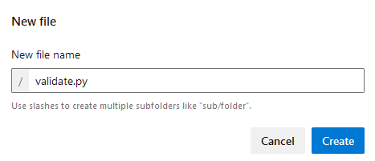
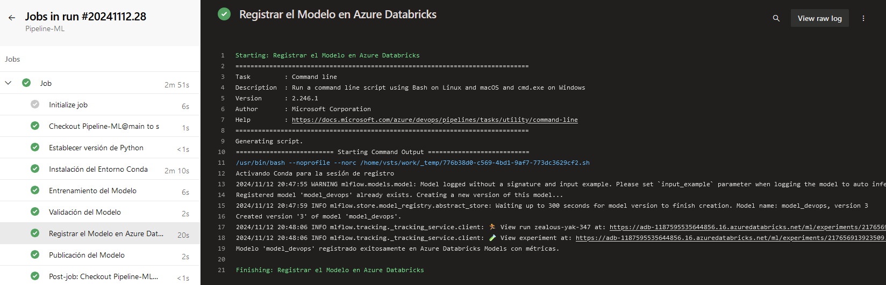

# Laboratorio 9. Pipeline de MLOps en Azure DevOps 

## Objetivo de la práctica:

Al finalizar la práctica, serás capaz de:

- Configurar un pipeline en Azure DevOps para el ciclo de vida de MLOps.
- Automatizar el entrenamiento y registro de modelos en Databricks.
- Versionar y gestionar el flujo de trabajo de machine learning utilizando integración y entrega continua (CI/CD).

## Duración aproximada:
- 70 minutos.

---

**[⬅️ Atrás](https://netec-mx.github.io/MLOPS-DATABRI/Cap%C3%ADtulo6/README_6.2.html)** | **[Lista General](https://netec-mx.github.io/MLOPS-DATABRI/)** | **[Siguiente ➡️](https://netec-mx.github.io/MLOPS-DATABRI/Cap%C3%ADtulo7/README_7.2.html)**

---

## Instrucciones 

### Tarea 1. Crear un repositorio en Azure DevOps con archivos de configuración inicial.

Configurarás un nuevo repositorio en Azure DevOps para almacenar los scripts de ML y los archivos de configuración necesarios para el pipeline de MLOps.

Paso 1. Inicia sesión en [**Azure DevOps**](https://dev.azure.com) y crea un nuevo proyecto llamado **`Pipeline-ML`** y clic en el botón **Create**.


Paso 2. Dentro del proyecto, ve a **Repos** e inicializa el nuevo repositorio, **Pipeline-ML**.


Paso 3. Crea el siguiente archivo llamado **`train.py`**. Da clic en los tres puntos y selecciona la opción **+ New** --> **File**.


Paso 4. Ahora, agrega el siguiente código:

```
import os
import pandas as pd
from sklearn.ensemble import RandomForestRegressor
from sklearn.model_selection import train_test_split
from sklearn.metrics import mean_squared_error, r2_score
import joblib
import mlflow

# Cargar y preparar los datos
data_path = "data/productos.csv"
df = pd.read_csv(data_path)
df['PrecioUd.'] = df['PrecioUd.'].str.replace("€", "").str.replace(".", "", regex=False).str.replace(",", ".").astype(float)
df['Beneficio neto'] = df['Beneficio neto'].str.replace("€", "").str.replace(".", "", regex=False).str.replace(",", ".").astype(float)

# Variables predictoras y objetivo
X = df[['PrecioUd.', 'Unidades']]
y = df['Beneficio neto']

# Separar en conjuntos de entrenamiento y prueba
X_train, X_test, y_train, y_test = train_test_split(X, y, test_size=0.2, random_state=42)

# Guardar conjuntos de prueba para la validación
os.makedirs("outputs", exist_ok=True)
X_test.to_csv("outputs/X_test.csv", index=False)
y_test.to_csv("outputs/y_test.csv", index=False)

# Entrenar el modelo
model = RandomForestRegressor(n_estimators=100, random_state=42)
model.fit(X_train, y_train)
joblib.dump(model, 'outputs/model.joblib')
print("Modelo entrenado y guardado como 'outputs/model.joblib'.")

# Evaluación en conjunto de prueba
y_pred = model.predict(X_test)
rmse = mean_squared_error(y_test, y_pred, squared=False)
r2 = r2_score(y_test, y_pred)

# Guardar las métricas en un archivo
with open("outputs/metrics.txt", "w") as f:
    f.write(f"RMSE: {rmse}\n")
    f.write(f"R2: {r2}\n")

print(f"Resultados del Entrenamiento:")
print(f"RMSE en conjunto de prueba: {rmse}")
print(f"R2 en conjunto de prueba: {r2}")

# Registrar el modelo y métricas en MLflow (para local tracking si se desea)
mlflow.start_run()
mlflow.log_metric("RMSE", rmse)
mlflow.log_metric("R2", r2)
mlflow.sklearn.log_model(model, "random_forest_model")
mlflow.end_run()
```

Paso 5. Da clic en el botón **Commit** y confirma nuevamente **Commit**.


Paso 6. Repite el paso **3** para crear un nuevo archivo llamado **`environment.yml`**.

Paso 7. Agrega el siguiente código en el archivo:

```
name: mlops-environment:
channels:
  - defaults
dependencies:
  - python=3.8
  - pip:
      - mlflow
      - pandas
      - scikit-learn
      - azure-cli
      - databricks-cli
```

Paso 8. Repite el paso 5 **Commit** y despues **Commit**.

Paso 9. Crea una carpeta llamada **`data`** y un archivo llamado **`README.md`**. Da clic en los 3 puntos y selecciona la opción **+ New** --> **Folder**.


Paso 10. Deja el archivo vacío y solo haz **Commit** dos veces.

Paso 11. Descarga los datos de la siguiente URL a tu computadora local o máquina virtual. Si ya los tienes, avanza al siguiente paso.

```
https://s3.us-west-2.amazonaws.com/labs.netec.com/courses/MLOPS_Databricks/V0.0.1/productos.csv
```

Paso 12. Da clic en los tres puntos de la carpeta creada **data** y selecciona **Upload files**.

Paso 13. En la ventana lateral derecho busca el archivo **productos.csv** descargado y cárgalo. Clic en el botón **Commit**.


Paso 14. Los archivos cargados quedarán como en la siguiente imagen:


**¡TAREA FINALIZADA!**

El repositorio de Azure DevOps ha sido creado y contiene los archivos de configuración iniciales para el pipeline.

### Tarea 2. Configurar el Pipeline en Azure DevOps para entrenamiento y registro.

Configurarás un pipeline en Azure DevOps para automatizar el entrenamiento y registro del modelo en Databricks.

Paso 1. En **Azure DevOps**, navega a **Pipelines** y selecciona **New Pipeline**.


Paso 2. Selecciona **Azure Repos Git** y el repositorio **Pipeline-ML** y configura el pipeline utilizando **Starter pipeline**.

Paso 3. Configura el pipeline para incluir las siguientes etapas:

- Instalación del entorno: **environment.yml**
- Entrenamiento del modelo: **train.py**
- Registro del modelo: **MLflow**

Paso 4. Borra todo el contenido del YAML actual.

Paso 5. Copia y pega el siguiente código:

```
trigger:
  branches:
    include:
      - main

pool:
  vmImage: 'ubuntu-latest'

steps:
  - task: UsePythonVersion@0
    inputs:
      versionSpec: '3.8'

  - script: |
      # Instalar el entorno de Conda desde environment.yml
      conda env create -f environment.yml
    displayName: 'Instalación del Entorno Conda'

  - script: |
      # Configurar Conda y activar el entorno
      echo "Activando Conda para la sesión"
      eval "$(conda shell.bash hook)"
      conda activate mlops-environment
      python train.py
    displayName: 'Entrenamiento del Modelo'

  - task: PublishBuildArtifacts@1
    inputs:
      pathToPublish: 'outputs/'
      artifactName: 'model'
    displayName: 'Registrar el Modelo'
```

Paso 6. Ahora da clic en el botón **Save and run**.


Paso 7. Nuevamente en la ventana **Save and run**.

Paso 8. Podrás observar el **Job** en ejecución.


Paso 9. Da clic en el nombre para entrar a la consola de los detalles de la ejecución.


**NOTA:** Espera unos minutos la compilación.


**¡TAREA FINALIZADA!**

El pipeline de entrenamiento y registro ha sido configurado y ejecutado exitosamente en Azure DevOps.

### Tarea 3. Añadir etapa de pruebas para validación del modelo.

Añadirás una etapa en el pipeline para validar el modelo entrenado mediante pruebas de rendimiento antes de su despliegue.

Paso 1. Regresa a la sección de **Repos** en el menú lateral izquierdo.

Paso 2. En la raíz del folder agrega otro archivo llamado **`validate.py`**.



Paso 3. Dentro del archivo agrega el siguiente código que validará el entrenamiento:

```
import pandas as pd
from sklearn.metrics import mean_squared_error, r2_score
import joblib

# Cargar datos preparados de prueba
X_test = pd.read_csv("outputs/X_test.csv")
y_test = pd.read_csv("outputs/y_test.csv")

# Cargar el modelo
model = joblib.load("outputs/model.joblib")
print("Modelo cargado exitosamente desde 'outputs/model.joblib'.")

# Realizar predicciones y calcular métricas de validación
y_pred = model.predict(X_test)
rmse = mean_squared_error(y_test, y_pred, squared=False)
r2 = r2_score(y_test, y_pred)

print(f"Resultados de la Validación:")
print(f"RMSE: {rmse}")
print(f"R2: {r2}")

# Validación de criterios
if rmse > 200 or r2 < 0.5:
    print("Advertencia: El modelo no cumple con los criterios de validación.")
    raise ValueError("El modelo no cumple con los criterios de validación.")
else:
    print("El modelo cumple con los criterios de validación.")
```

Paso 4. Clic en el botón **Commit** dos veces.

**NOTA:** Eso disparará el pipeline, pero descuida, no hay problema.

Paso 5. Muy bien, ahora da clic en la opción **Pipelines** del menú lateral izquierdo.

Paso 6. Da clic en el nombre del pipeline creado llamado **Pipeline-ML**.


Paso 7. En la parte superior derecha da clic en **Edit**.


Paso 8. Al final de la **linea 25** da un salto de linea(Enter) y un retroceso(Borrar un espacio), copia y pega el siguiente bloque de código.

**NOTA:** La validación verifica que el modelo cumpla con los criterios de exactitud, como un **RMSE** menor a 10 y un **R2** superior a 0.8.

```
- script: |
      echo "Activando Conda para la sesión de validación"
      eval "$(conda shell.bash hook)"
      conda activate mlops-environment
      python validate.py
    displayName: 'Validación del Modelo'
```


Paso 9. Da clic en el botón superior derecho **Validate and save** despues **Save**

Paso 10. Da clic en el menú lateral izquierdo **Pipelines** luego clic en tu pipeline **Pipeline-ML**, clic en el **Job** en ejecución para ver los detalles de las fases.


**¡TAREA FINALIZADA!**

La etapa de validación del modelo ha sido añadida al pipeline para verificar el rendimiento antes del despliegue.

### Tarea 4: Registrar el Modelo Validado en Azure Databricks Models

En esta tarea vas a registrar el modelo validado en el Model Registry de Azure Databricks desde Azure DevOps.

Paso 1. Primero abre tu perfil de Azure Databricks.

- Abre el **portal de Azure**.
- Ve a tus grupos de recursos
- Selecciona el grupo que comienza con **ddbricksrg-XXXX-###**
- Da clic en tu servicio de Azure Databricks. En este punto **copia la URL** y guardala en tu bloc de notas.

- Clic en **Launch Workspace** 

Paso 2. Dentro del Workspace de Azure Databricks da clic en la esquina superior derecha, selecciona **tu perfil** y haz clic en **Settings**.


Paso 3. En el menú vertical selecciona **Developer**


Paso 4. Ahora clic en la opción **Manage** de la sección **Access Tokens**.


Paso 5. Clic en el botón **Generate new token** y escribe el nombre **`mlopstoken`**.


Paso 6. Guarda el **Token** en tu bloc de notas para usarlo despues.

Paso 7. En el menú lateral izquierdo da clic en **Experiments**.


Paso 8. Copia el valor de la sección **Location** y guardalo tambien en el bloc de notas.


Paso 9. De vuelta a la pestaña de **Azure DevOps** selecciona **Repos**.

Paso 10. Agrega un nuevo archivo llamado **register_model.py** en la raíz del directorio.

Paso 11. Copia y pega el siguiente código al archivo, y ejecuta **Commit** 2 veces para guardar cambios.

```
import mlflow
import mlflow.sklearn
from mlflow.tracking import MlflowClient
import joblib

# Configurar la URL de tracking de MLflow para Databricks
mlflow.set_tracking_uri("databricks")

# Definir el nombre del experimento en Databricks
experiment_name = "/Users/instructorjorg@azurenetecgp2.onmicrosoft.com/Entrenamiento_Modelo"
mlflow.set_experiment(experiment_name)

# Cargar el modelo validado desde la ubicación donde fue guardado
model_path = "outputs/model.joblib"
model_name = "model_devops"
model = joblib.load(model_path)  # Cargar el modelo antes de intentar registrarlo

# Leer las métricas de RMSE y R2 del archivo generado en train.py
with open("outputs/metrics.txt", "r") as f:
    lines = f.readlines()
    rmse = float(lines[0].strip().split(": ")[1])
    r2 = float(lines[1].strip().split(": ")[1])

# Registrar el modelo en MLflow y en el Model Registry de Databricks
with mlflow.start_run() as run:
    mlflow.log_metric("RMSE", rmse)
    mlflow.log_metric("R2", r2)
    mlflow.sklearn.log_model(model, "model", registered_model_name=model_name)

print(f"Modelo '{model_name}' registrado exitosamente en Azure Databricks Models con métricas.")
```

**NOTA:** Recuerda que cada cambio ejecuta el **Pipeline** pero al final tomaremos la ultima ejecución.

Paso 12. Ahora ve a tu **Pipeline-ML** de la sección **Pipelines** y Editalo.

Paso 13. Da clic en la opción **Variables** en la esquina superior derecha.


Paso 14. Agrega 2 variables y da clic en el botón **Save**.

| Nombre | Valor |
| DATABRICKS_HOST | URL Databricks guardada en tu bloc de notas |
| DATABRICKS_TOKEN | Token guardado en tu bloc de notas |


Paso 15. Ahora  edita el código de tu pipeline para realizar la conexion a Azure databricks con las variables. Copia y pega el siguiente código entre **Validación del modelo** y **Publicación del modelo como artefacto**

**NOTA:** Cuidado con la identación. Ajusta el código si es necesario.

```
  # Registro del modelo en Databricks
  - script: |
      echo "Activando Conda para la sesión de registro"
      eval "$(conda shell.bash hook)"
      conda activate mlops-environment

      # Configurar variables de entorno para Databricks
      export MLFLOW_TRACKING_URI=databricks
      export DATABRICKS_HOST=$(DATABRICKS_HOST)
      export DATABRICKS_TOKEN=$(DATABRICKS_TOKEN)
      
      # Registrar el modelo en Databricks
      python register_model.py
    displayName: 'Registrar el Modelo en Azure Databricks'
```


Paso 16. Finalmente guarda el pipeline y monitorea la ejecución.



Paso 17. Recuerda que tambien puedes revisar en la interfaz de **Azure Databricks**

- Experiments


**¡TAREA FINALIZADA!**

Has completado el registro del modelo validado en Azure Databricks, donde podrás gestionar sus versiones

**¡LABORATORIO FINALIZADO!**

### Resultado esperado

Al finalizar este laboratorio, habrás configurado un pipeline de MLOps en Azure DevOps que automatiza el entrenamiento, validación, registro de un modelo de machine learning en Databricks.


---

**[⬅️ Atrás](https://netec-mx.github.io/MLOPS-DATABRI/Cap%C3%ADtulo6/README_6.2.html)** | **[Lista General](https://netec-mx.github.io/MLOPS-DATABRI/)** | **[Siguiente ➡️](https://netec-mx.github.io/MLOPS-DATABRI/Cap%C3%ADtulo7/README_7.2.html)**

---
