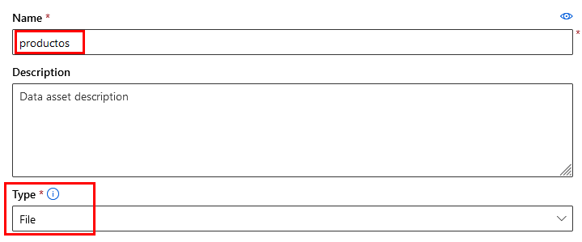
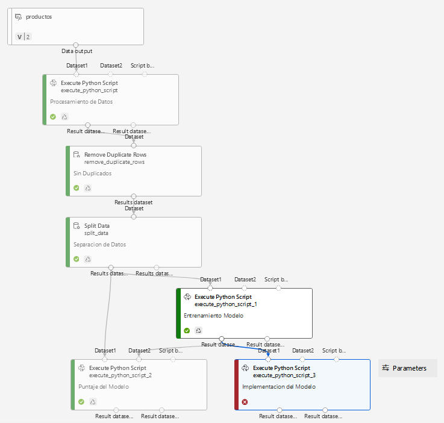

# Laboratorio 7.2. Pipeline de MLOps en Azure Machine Learning Studio 

## Objetivo de la práctica:

Al finalizar la práctica, serás capaz de:

- Configurar y ejecutar un pipeline en Azure Machine Learning Studio desde el canvas gráfico.
- Implementar tareas de preprocesamiento, entrenamiento y despliegue del modelo de machine learning.
- Validar el pipeline mediante la ejecución de inferencias en el modelo desplegado.

## Duración aproximada:
- 70 minutos.

---

**[⬅️ Atrás](/Capítulo7/README_7.1.md)** | **[Lista General](/README.md)** | **[Siguiente ➡️](/Capítulo8/README_8.1.md)**

---

## Instrucciones 

### Tarea 1: Cargar el Dataset en el Canvas de Azure ML Studio

En esta tarea, cargarás el dataset de productos en el canvas del pipeline de Azure Machine Learning Studio para usarlo como entrada en las siguientes etapas.

Paso 1. Abre tu portal de azure [AQUÍ](https://portal.azure.com) y autenticate con el usuario asignado.

Paso 2. En la parte superior busca el servicio de **Azure Machine Learning** y da clic.

Paso 3. Selecciona tu workspace creado previamente en el laboratorio 6.1. Puedes identificarlo por tus iniciales. Da clie en el nombre del workspace.


Paso 4. Ahora da clic en **Lunch studio**


**NOTA:** Espera a que cargue unos segundos.

Paso 5. En el menú laterial izquierdo da clic en **Data** y luego en **+ Create**.


Paso 6. Define el nombre del dataset escribe **`productos`** en el campo **Name**. Da clic en **Next**.



Paso 7. En la siguiente ventana selecciona **From local files** y da clic en **Next**.


Paso 8. Copia y pega la siguiente URL en una ventana de tu navegador y descarga el dataset.

```
https://s3.us-west-2.amazonaws.com/labs.netec.com/courses/MLOPS_Databricks/V0.0.1/productos.csv
```

Paso 9. Selecciona **Azure Blob Storage** y el nombre del storage que creaste en el laboratorio 6.1, clic en **Next**


Paso 10. Da clic en el botón **Upload files or folder**, busca y carga tu archivo de datos. Luego da clic en **Next**.

Paso 11. En la sección de **Settings** deja los valores por defecto y da clic en **Next**

Paso 12. Clic en **Next**.

Paso 13. Clic en **Create**.

**NOTA:** El proceso tardara unos segundos.

**TAREA FINALIZADA**

El dataset ha sido creado y está disponible bajo el nombre `producto`.

### Tarea 2: Creación de un Pipeline en Azure ML Studio.

En esta tarea crearas el pipeline que tomara los datos, preparar, dividira, entrenada y validara para el proceso del modelo.

Paso 1. En el menú lateral izquierdo selecciona la opción **Pipelines**.


Paso 2. Da clic en el botón **+ New pipeline**


Paso 3. Da clic en el simbolo **+** para crear un nuevo pipeline.


Paso 4. Ahora selecciona la opcion **Data** del menú vertical izquierdo y luego arrastra tu dataset **producto** hacia el canvas y sueltalo.


**¡TAREA FINALIZADA!**

El dataset ha sido cargado y está disponible en el pipeline bajo el nombre `producto`.

### Tarea 3: Preprocesamiento de Datos con Script en Python

Usaremos un script de Python para aplicar transformaciones al dataset, como la normalización o creación de nuevas características.

Paso 1. Selecciona del menú izquierdo, **Component** luego **Python Language** y **Execute Python Script**.


Paso 2. Arrastralo al canvas debajo del dataset **productos**.


Paso 3. Ahora Conecta el dataset **productos** al script de python como lo muestra la imagen.


Paso 4. Ahora selecciona el rectangulo del script y da clic en el botón lateral derecho que expande las propiedades del script.


Paso 5. Borra todo el codigo predeterminado y copia y pega el siguiente codigo dentro de la seccion del script.

```
import pandas as pd
import re

def azureml_main(dataframe1=None, dataframe2=None):
    # Verificar y limpiar la columna 'PrecioUd'
    if "PrecioUd" in dataframe1.columns:
        print("Valores de PrecioUd antes de la limpieza:", dataframe1["PrecioUd"].head())
        
        # Limpiar el valor para eliminar símbolos y separadores de manera robusta
        dataframe1["PrecioUd"] = (
            dataframe1["PrecioUd"]
            .str.replace(r"[^0-9,]", "", regex=True)  # Mantener solo números y comas
            .str.replace(".", "", regex=False)        # Eliminar puntos como separador de miles
            .str.replace(",", ".", regex=False)       # Cambiar coma decimal a punto
            .astype(float)                            # Convertir a float
        )

        # Convertir a USD directamente en la misma columna
        tasa_cambio = 1.07
        dataframe1["PrecioUd"] = (dataframe1["PrecioUd"] * tasa_cambio).round(2)
        print("Valores de PrecioUd después de la conversión a USD:", dataframe1["PrecioUd"].head())
    else:
        print("La columna 'PrecioUd' no existe en el dataset.")
    
    # Redondear Beneficio neto
    if "Beneficio neto" in dataframe1.columns:
        dataframe1["Beneficio neto"] = (
            dataframe1["Beneficio neto"]
            .str.replace(r"[^0-9,]", "", regex=True)  # Mantener solo números y comas
            .str.replace(".", "", regex=False)
            .str.replace(",", ".", regex=False)
            .astype(float)
            .round(2)
        )
        print("Valores de Beneficio neto después de la conversión:", dataframe1["Beneficio neto"].head())
    
    # Seleccionar las columnas relevantes para ML si existen
    columns_ml = ["PrecioUd", "Unidades", "Beneficio neto"]
    df_ml = dataframe1[[col for col in columns_ml if col in dataframe1.columns]]
    
    return df_ml
```

Paso 6. Una vez editado, baja a la sección **Node information** y agrega una descripción de lo que hara el script. Escribe **`Procesamiento de Datos`**


Paso 7. Da clic en el botón **Save**


**¡TAREA FINALIZADA!**

El script de procesamiento ha sido cargado y está listo.

### Tarea 4: Eliminar Filas Duplicadas en el Dataset de Entrenamiento

Usaremos el componente `Remove_Duplicate_Rows` para eliminar duplicados en el conjunto de datos de entrenamiento.

Paso 1. En el buscador de componentes escribe **`Remove`** y espera el resultado del filtro. Arrastra el componente **Remove Duplicate Rows** al canvas.


Paso 2. Conecta la salida del script de procesamiento a la entrada del componente que remueve duplicados.


Paso 3. Has clic en el componende de duplicados para abrir el panel de propiedades y da clic en la opción **Edit column**


Paso 4. En la lista **Include** selecciona **All columns** y da clic en el botón **Save**.


Paso 5. En la sección **Node information** escribe la descripción **`Sin Duplicados`**.


Paso 6. Da clic en el botón **Save**


**¡TAREA FINALIZADA!**

Se han eliminado duplicados en el conjunto de datos de procesamiento.

### Tarea 5: Dividir el Dataset en Entrenamiento y Prueba

Dividiremos el dataset en dos conjuntos: entrenamiento y prueba, usando el componente `Split_Data` en el canvas.

Paso 1. En el buscador de componentes escribe **`Split`** y espera el resultado del filtro. Arrastra el componente **Split Data** al canvas.


Paso 2. Conecta la salida del remove duplicate rows a la entrada del componente split data.


Paso 3. Has clic en el componende de split data para abrir el panel de propiedades y configura lo siguiente:

- Fraction of rows in the first output dataset = 0.8
- Random seed = 123
- Stratified split = True
- Stratification key column = Column names: Unidades


Paso 4. En la sección **Node information** escribe la descripción **`Sin Duplicados`**.


Paso 5. Da clic en el botón **Save**


**¡TAREA FINALIZADA!**

El dataset ha sido dividido en `Entrenamiento` 80% y `Prueba` 20%.

### Tarea 6: Entrenamiento del Modelo de Machine Learning

En esta tarea, entrenaremos un modelo de machine learning usando el dataset preprocesado.

Paso 1. Selecciona del menú izquierdo, **Component** luego **Python Language** y **Execute Python Script**.


Paso 2. Arrastralo al canvas debajo del componente **Split Data** y conectalo como lo muestra la imagen.


Paso 3. Has clic en el componende del script de python para abrir el panel de propiedades.

Paso 4. Borra el contenido del codigo predefinido.

Paso 5. Copia y pega el siguiene codigo en el editor del componente.

```
import subprocess
import sys

# Instalar scikit-learn si no está disponible
subprocess.check_call([sys.executable, "-m", "pip", "install", "scikit-learn"])

# Importar las bibliotecas necesarias
from azureml.core import Workspace, Model
from sklearn.linear_model import LinearRegression
import pickle

def azureml_main(dataframe1=None, dataframe2=None):
    # Verificar que el dataframe tenga las columnas necesarias
    if dataframe1 is None or "Unidades" not in dataframe1.columns or "PrecioUd" not in dataframe1.columns or "Beneficio neto" not in dataframe1.columns:
        raise ValueError("El dataset de entrada debe contener las columnas 'Unidades', 'PrecioUd' y 'Beneficio neto'.")

    # Configurar el modelo y el conjunto de datos
    X = dataframe1[["Unidades", "PrecioUd"]]
    y = dataframe1["Beneficio neto"]

    # Entrenar el modelo
    model = LinearRegression()
    model.fit(X, y)

    # Guardar el modelo localmente
    model_path = "modelo_lineal.pkl"
    with open(model_path, "wb") as file:
        pickle.dump(model, file)

    # Configurar el acceso al workspace de Azure ML
    ws = Workspace(subscription_id="TU_SUSCRIPCION",
                   resource_group="TU_RG",
                   workspace_name="TU_ML_WORKSPACE")

    # Registrar el modelo en el workspace de Azure ML
    registered_model = Model.register(workspace=ws,
                                      model_path=model_path,
                                      model_name="modelo_lineal_ventas")

    print("Modelo registrado en Azure ML con éxito")
    
    # Devolver el dataframe de entrada como una tupla
    return dataframe1,
```

Paso 4. Edita las lineas **31, 32 y 33** con los valores correspondientes. Los puedes encontrar en el icono superior derecha.

- TU_SUSCRIPCION
- TU_RG
- TU_ML_WORKSPACE


Paso 5. En la sección **Node information** escribe la descripción **`Entrenamiento Modelo`**.


Paso 6. Da clic en el botón **Save**


**¡TAREA FINALIZADA!**

El modelo ha sido entrenado y está disponible en el canvas como `Entrenamiento Modelo`.

### Tarea 7: Evaluación y Puntaje del Modelo

En esta tarea, utilizaremos el conjunto de prueba para evaluar el modelo entrenado y obtener el puntaje de predicción.

Paso 1. Selecciona del menú izquierdo, **Component** luego **Python Language** y **Execute Python Script**.


Paso 2. Arrastralo al canvas debajo del componente **Split Data** y conectalo como lo muestra la imagen. Ademas agrega la conexión de la salida de **Entrenamiento Modelo** a la entrada de **Dataset2** de la validacion.


Paso 3. Has clic en el componende del script de python para abrir el panel de propiedades.

Paso 4. Borra el contenido del codigo predefinido.

Paso 5. Copia y pega el siguiene codigo en el editor del componente.

```
# Importar las bibliotecas necesarias
import pickle
from azureml.core import Workspace, Model
from sklearn.linear_model import LinearRegression

def azureml_main(dataframe1=None, dataframe2=None):
    # Verificar que el dataframe tenga las columnas necesarias
    if dataframe1 is None or "Unidades" not in dataframe1.columns or "PrecioUd" not in dataframe1.columns:
        raise ValueError("El dataset de entrada debe contener las columnas 'Unidades' y 'PrecioUd'.")

    # Configurar el acceso al workspace de Azure ML
    ws = Workspace(subscription_id="TU_SUSCRIPCION",
                   resource_group="TU_RG",
                   workspace_name="TU_ML_WORKSPACE")

    # Cargar el modelo registrado en Azure ML
    model_path = Model.get_model_path("modelo_lineal_ventas", _workspace=ws)
    with open(model_path, "rb") as file:
        model = pickle.load(file)

    # Preparar los datos para hacer la predicción
    X_test = dataframe1[["Unidades", "PrecioUd"]]

    # Realizar predicciones
    dataframe1["Prediccion_Beneficio_Neto"] = model.predict(X_test)

    # Imprimir algunas predicciones para verificar
    print("Predicciones:", dataframe1["Prediccion_Beneficio_Neto"].head())

    # Devolver el DataFrame de entrada modificado como una tupla
    return dataframe1,
```

Paso 4. Edita las lineas **12, 13 y 14** con los valores correspondientes. Los puedes encontrar en el icono superior derecha.

- TU_SUSCRIPCION
- TU_RG
- TU_ML_WORKSPACE


Paso 5. En la sección **Node information** escribe la descripción **`Puntaje del Modelo`**.


Paso 6. Da clic en el botón **Save**


**¡TAREA FINALIZADA!**

El modelo ha sido evaluado y el puntaje está disponible como `Puntaje del Modelo`.

### Tarea 8: Despliegue del Modelo

Finalmente, desplegaremos el modelo para el uso en inferencias.

Paso 1. Selecciona del menú izquierdo, **Component** luego **Python Language** y **Execute Python Script**.


Paso 2. Arrastralo al canvas debajo del componente **Entrenamiento Modelo** y conectalo como lo muestra la imagen.


Paso 3. Has clic en el componende del script de python para abrir el panel de propiedades.

Paso 4. Borra el contenido del codigo predefinido.

Paso 5. Copia y pega el siguiene codigo en el editor del componente.

```
import subprocess
import sys
import os

# Instalar las dependencias necesarias
subprocess.check_call([sys.executable, "-m", "pip", "install", "azureml-core"])

# Crear el archivo `score_script.py` dentro del script de implementación
score_script_content = """
import json
import pickle
import numpy as np
from azureml.core.model import Model

def init():
    global model
    model_path = Model.get_model_path("modelo_lineal_ventas")
    with open(model_path, "rb") as file:
        model = pickle.load(file)

def run(data):
    try:
        input_data = json.loads(data)
        X_test = np.array(input_data["data"])
        predictions = model.predict(X_test)
        return json.dumps({"predictions": predictions.tolist()})
    except Exception as e:
        return json.dumps({"error": str(e)})
"""

# Guardar el contenido en un archivo `score_script.py`
with open("score_script.py", "w") as file:
    file.write(score_script_content)

# Importar las bibliotecas de Azure ML para el despliegue
from azureml.core import Workspace, Model, Environment
from azureml.core.model import InferenceConfig
from azureml.core.webservice import AciWebservice

def deploy_model():
    # Configurar el acceso al workspace de Azure ML
    ws = Workspace(subscription_id="TU_SUSCRIPCION",
                   resource_group="TU_RG",
                   workspace_name="TU_ML_WORKSPACE")

    # Cargar el modelo registrado
    registered_model = Model(ws, name="modelo_lineal_ventas")

    # Crear un entorno personalizado de scikit-learn
    sklearn_env = Environment(name="custom_sklearn_env")
    sklearn_env.python.conda_dependencies.add_pip_package("scikit-learn")
    sklearn_env.python.conda_dependencies.add_pip_package("numpy")

    # Configuración para la implementación en ACI
    inference_config = InferenceConfig(entry_script="score_script.py",  
                                       environment=sklearn_env)

    deployment_config = AciWebservice.deploy_configuration(cpu_cores=1, memory_gb=1)
    service_name = "servicio-modelo-lineal"

    # Implementar el modelo
    service = Model.deploy(workspace=ws,
                           name=service_name,
                           models=[registered_model],
                           inference_config=inference_config,
                           deployment_config=deployment_config)
    service.wait_for_deployment(show_output=True)

    print(f"Servicio implementado en: {service.scoring_uri}")

# Ejecutar la función de implementación
deploy_model()
```

Paso 4. Edita las lineas **42, 43 y 44** con los valores correspondientes. Los puedes encontrar en el icono superior derecha.

- TU_SUSCRIPCION
- TU_RG
- TU_ML_WORKSPACE


Paso 5. En la sección **Node information** escribe la descripción **`Implementacion del Modelo`**.


Paso 6. Da clic en el botón **Save**


Paso 7. El pipeline final quedara de la siguiente manera.


**¡TAREA FINALIZADA!**

El modelo ha sido desplegado en ACI.

### Tarea 9: Ejecutar el Pipeline de Azure Machine Learning Studio

En esta tarea probaras el funcionamiento del pipeline creado.

Paso 1. Clic en el botón **Configure & Submit**


Paso 2. Configura la pestaña **Basics** como lo muestra la imagen.


Paso 3. Clic en el botón **Next**.

Paso 4. En la sección **Inputs & Outputs** da clic en **Next**.

Paso 5. En la sección **Runtime settings** selecciona **Compute cluster** y da clic en **Create Azure ML Compute cluster.


Paso 6. Selecciona tu región y el tipo de maquina virtual **Standard_DS11_v2** y da clic en siguiente.

**NOTA:** Si el tipo de maquina no esta disponible usa otra.


Paso 7. Escribe el nombre del nodo **`ml-compute`** y da clic en **Create**.

**NOTA:** El proceso tardara varios minutos, espera a que este todo creado.


Paso 8. Cuando ya este creada, da clic en el botón **Review + Submit**.


Paso 9. Finalmente **Submit**.

Paso 10. Eso creara el Job que puedes validar en la sección **Jobs** lateral izquierdo. Ahi estara ejecutandose.


Paso 11. Da clic en el experimento que esta en ejecución y veras los detalles del pipeline. Puedes investigar las propiedades que necesites.


Paso 12. Da doble clic en el componente de **Entrenamiento Modelo** para ver el panel de propiedades.

Paso 13. Da clic en la propiedad **Outputs + logs** y actualiza frecuentemente.


Paso 14. Aparecera el archivo **std_log.txt** y en los logs de la derecha te dara un link y un codigo para la autenticación, sino lo haces el pipeline no avanzara.


Paso 15. Posiblemente tengas que repetir el proceso de autenticación para **Puntaje del Modelo** e **Implementación del Modelo**.

Paso 16. El proceso completo puede tardar varios minutos, espera a que todas las fases del pipeline esten completas.

Paso 17. En la ultima fase de **Implementación del Modelo** aparecera un error indicando sobre un atributo **azureml_main**. Se debe a que Machine Learning Studio está buscando una función **azureml_main** que no existe en este script de despliegue.



Paso 18. Entre la linea **225 y 230** de los logs copia la URL del ednpoint desplegado y guardala en un bloc de notas.


Paso 19. No te preocupes el despliegue fue un exito a pesar de ese mensaje.

Paso 20. Para probarlo puedes ir a una de tus libretas como la de **Iris** encender tu nodo de computo y al final agregar otra celda copiar el siguiente codigo que realizara la prueba. **Sustitutye la linea 5 con la URL del endpoint creado**

```
import requests
import json

# URL del servicio desplegado en ACI
scoring_uri = "URL_DEL_SERVICIO"  # Reemplaza con `service.scoring_uri` del despliegue

# Datos de entrada de prueba para el modelo
input_data = {
    "data": [
        [5, 200],   # Ejemplo de datos: Unidades y PrecioUd
        [3, 150]
    ]
}

# Convertir los datos de entrada a formato JSON
input_data_json = json.dumps(input_data)

# Encabezados para la solicitud de predicción
headers = {"Content-Type": "application/json"}

# Enviar la solicitud POST al servicio
response = requests.post(scoring_uri, data=input_data_json, headers=headers)

# Imprimir la respuesta del servicio
print("Respuesta del servicio:", response.json())
```


**NOTA:** Las predicciones te indican cuánto beneficio se espera, de acuerdo con los datos de entrada proporcionados para cada observación en el conjunto de datos de prueba.

**¡TAREA FINALIZADA!**

Has completado de validar tu pipeline de ML y probado el resultado de la predicción.

**¡LABORATORIO FINALIZADO!**

### Resultado esperado

Creamos un pipeline de MLOps en Azure que abarca la preparación de datos, entrenamiento y despliegue de un modelo de regresión lineal en ACI, logrando un flujo automatizado para predicciones de beneficio neto en tiempo real.


---

**[⬅️ Atrás](/Capítulo7/README_7.1.md)** | **[Lista General](/README.md)** | **[Siguiente ➡️](/Capítulo8/README_8.1.md)**

---