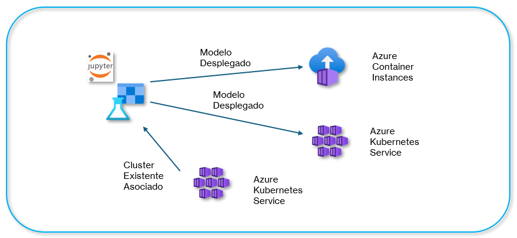

# Laboratorio 8.1. Despliegue de Servicio de Cómputo

## Objetivo de la práctica:

Al finalizar la práctica, serás capaz de:

- Configurar un entorno de Azure Machine Learning.
- Entrenar un modelo de clasificación utilizando el dataset de diabetes.
- Desplegar el modelo en un clúster de Azure Kubernetes Service (AKS).
- Configurar el escalado automático del servicio de cómputo en AKS.

## Objetivo Visual:



## Duración aproximada:
- 105 minutos.

---

**[⬅️ Atrás](/Capítulo7/README_7.2.md)** | **[Lista General](/README.md)** | **[Siguiente ➡️](/Capítulo8/README_8.2.md)**

---

## **Prerrequisitos:**

- Una suscripción a Azure.
- Conocimientos básicos de Python y Machine Learning.
- Conocimiento básico de Kubernetes.

## Instrucciones:

### Tarea 1. Preparación del Entorno.

En esta tarea, prepara todo lo necesario para entrenar y desplegar el modelo, incluyendo el uso del Workspace en Azure Machine Learning, la configuración del entorno de trabajo y la carga del conjunto de datos.

Paso 1. Dirígete al Portal de Azure e inicia sesión con tu cuenta en [Azure Portal](https://portal.azure.com/).

Paso 2. En la barra de búsqueda del portal, escribe **`Kubernetes Services`** y selecciona **`Kubernetes Services`**.

Paso 3. Haz clic en la parte superior izquierda llamada **`Create`** y en el menú desplegable selecciona **`Kubernetes cluster`**.


Paso 4. En la configuración del clúster de Kubernetes **Create Kubernetes cluster**, configura lo siguiente:

| Parámetro       | Valores |
|-----------------|---------|
| Subscription    | Selecciona la **suscripción** de tu cuenta o la que se asignó para el curso. |
| Resource Group  | Selecciona o crea **mlrg-XXXX**. |
| Cluster preset configuration | Selecciona **Dev/Test**. |
| Kubernetes cluster name | Escribe **kubemlcluster-XXXX**. |
| Región | Selecciona la región que te haya tocado. |

**NOTA:** El resto de la configuración se quedará por defecto.

Paso 5. Haz clic en la opción inferior **`Next`**.

Paso 6. En la sección **Node Pools**, haz clic en el nombre **`agentpool`**.

Paso 7. Selecciona **Autoscale** y cambia la propiedad **Minimum node count** de **1** a **2**.

Paso 8. Verifica que esté seleccionado **`Autoscale - Recommended`** y marca la casilla **Enable public IP per node**.

Paso 9. Haz clic en el botón **`Update`**.

 

Paso 10. Da clic en el botón **`Review + create`**. Espera a que valide la configuración.

Paso 11. Haz clic en el botón **`Create`**.

**NOTA:** Espera de **5 a 10 minutos** aproximadamente a que termine la creación del clúster.

Paso 12. Una vez creado, haz clic en el botón **`Go to resource`**.

Paso 13. Ahora haz clic en la opción llamada **`Cloud Shell`**.


Paso 14. En la terminal inferior, escribe el siguiente comando; deberás sustituir los siguientes valores:

- --cluster-name
- --resource-group

```
az k8s-extension create --name azureml --extension-type Microsoft.AzureML.Kubernetes --config enableTraining=True enableInference=True inferenceRouterServiceType=LoadBalancer allowInsecureConnections=True InferenceRouterHA=False --cluster-type managedClusters --cluster-name <cluster> --resource-group <rg> --scope cluster
```

Paso 15. Si te pide confirmación, escribe **Y** y espera la configuración.

**NOTA:** Estos pasos son demostrativos para la creación del cluster.

**NOTA:** Espera un estimado de **5 a 20 minutos** a que termine de habilitar la extensión de Azure Machine Learning.

**NOTA:** 

Paso 16. En la barra de búsqueda del portal, escribe **`Machine Learning`** y selecciona **`Machine Learning`**.

Paso 17. Usa el **Workspace** de Azure Machine Learning **existente** creado en el laboratorio 1. Da clic en **Launch Studio**

Paso 18. Una vez abierto el Workspace, selecciona del menú lateral izquierdo **`Compute`**.


Paso 19. Selecciona la opción **Kubernetes clusters** y después el botón **`New`**. En el menú desplegable, haz clic en **`AksCompute`**.


Paso 20. En la ventana emergente lateral derecha, configura las propiedades como aparece en la imagen. Escribe el nombre **kubemlcompute-XX** cambia las **X** por las iniciales de tu nombre


Paso 21. Haz clic en el botón **`Attach`** y espera el proceso de asociación del clúster.

Paso 22. Finalmente, podrás observar el clúster correctamente asociado.


**¡TAREA FINALIZADA!**

Con esta tarea, has experimentado cómo crear un clúster de Azure Kubernetes Service y cómo asociarlo al Workspace de Azure Machine Learning. **Para el entrenamiento, usaremos otro clúster de tipo Kubernetes. Esta tarea fue demostrativa.**

### Tarea 2. Preparación y Entrenamiento del Modelo.

En esta tarea, configurarás todas las celdas necesarias para la preparación de los datos y el entrenamiento adecuado del modelo.

Paso 1. Dentro del workspace de Azure ML, haz clic en la opción **Notebooks** del menú lateral izquierdo.

Paso 2. Haz clic en la opción **`Files`** y crea una carpeta llamada **`diab-notebook`**.


Paso 3. Dentro de la carpeta, crea un archivo de tipo Jupyter llamado **diab**.


Paso 4. Haz clic en el botón **`Create`**.

**NOTA:** Si ya no tienes el nodo **mlcompute** puedes volverlo a crear.

Paso 5. Haz clic en la opción **`Code`** para agregar la primera celda **(si ya aparece una celda, sólo pega el código de abajo)** y escribe el siguiente código que descargará los datos:

```
# Descargar y Preparar el Dataset de Diabetes
from sklearn.datasets import load_diabetes
import pandas as pd

# Cargar el dataset de diabetes
diabetes_data = load_diabetes(as_frame=True)
df = diabetes_data.frame

# Mostrar las primeras filas del dataset
df.head()
```


Paso 6. **Agrega otra celda más** y escribe el siguiente código para convertir el objetivo (target) del dataset en una variable binaria:

```
# Convertir el target a binario: 1 si el valor es mayor a 140, 0 en caso contrario
df['target'] = df['target'].apply(lambda x: 1 if x > 140 else 0)

# Mostrar la distribución de las clases
df['target'].value_counts()
```


Paso 7. Ejecuta el siguiente código en **otra celda** que guarda el dataset procesado en un archivo CSV:

```
# Guardar el dataset en un archivo CSV
df.to_csv('diabetes.csv', index=False)

# Verifica que el archivo se haya guardado correctamente
!ls -l diabetes.csv
```


Paso 8. Divide el dataset en conjuntos de entrenamiento y prueba. Copia el siguiente código en otra celda:

```
from sklearn.model_selection import train_test_split

# Separar características (X) y objetivo (y)
X = df.drop(columns='target')
y = df['target']

# Dividir los datos en entrenamiento (80%) y prueba (20%) con estratificación
X_train, X_test, y_train, y_test = train_test_split(X, y, test_size=0.2, random_state=42, stratify=y)

# Mostrar las dimensiones de los conjuntos
print(X_train.shape, X_test.shape, y_train.shape, y_test.shape)
print(y_train.value_counts())
print(y_test.value_counts())
```


Paso 9. Entrena un modelo de regresión logística utilizando el conjunto de entrenamiento con el siguiente código:

```
from sklearn.linear_model import LogisticRegression

# Crear el modelo de regresión logística
model = LogisticRegression(max_iter=1000)

# Entrenar el modelo
model.fit(X_train, y_train)

# Verifica que el modelo se haya entrenado correctamente
accuracy = model.score(X_train, y_train)
print(f'Precisión del modelo en el conjunto de entrenamiento: {accuracy:.2f}')
```


Paso 10. Evalúa el rendimiento del modelo en el conjunto de prueba con el siguiente código:

```
from sklearn.metrics import accuracy_score

# Hacer predicciones en el conjunto de prueba
y_pred = model.predict(X_test)

# Calcular la precisión del modelo
accuracy = accuracy_score(y_test, y_pred)
print(f'Precisión del modelo en el conjunto de prueba: {accuracy:.2f}')
```


Paso 11. Guarda el modelo entrenado en un archivo `.pkl` para su despliegue posterior en la carpeta **outputs**.

```
import joblib
import os

# Crear la carpeta 'outputs' si no existe
os.makedirs('outputs', exist_ok=True)

# Guardar el modelo en la carpeta 'outputs'
joblib.dump(model, 'outputs/model.pkl')
```


Paso 12. Antes de proceder con el despliegue, valida el modelo entrenado con un ejemplo de predicción.

```
# Ejemplo de características de entrada (primera fila de X_test)
sample_data = X_test.iloc[0].values.reshape(1, -1)

# Convertir a DataFrame y asignar nombres de columnas
sample_df = pd.DataFrame(sample_data, columns=X_train.columns)

# Predicción
prediction = model.predict(sample_df)
print(f'Predicción para los datos de entrada: {"Tiene diabetes" if prediction[0] == 1 else "No tiene diabetes"}')
```


Paso 13. El resultado de los archivos creados hasta el momento es como lo muestra la imagen:


**¡TAREA FINALIZADA!**

Con esta tarea, has preparado y entrenado un modelo de regresión logística que predice si una persona tiene diabetes o no, basado en un conjunto de datos de características. El siguiente paso es desplegar este modelo en un clúster de Azure Kubernetes Service (AKS).

### Tarea 3. Registro y Despliegue del Modelo.

Paso 1. Registra el modelo previamente entrenado. Agrega una celda más con este código y ejecútala:

```
from azureml.core import Workspace
from azureml.core.model import Model
import joblib

# Conectar con el workspace
workspace = Workspace.from_config()

# Guardar el modelo
joblib.dump(model, 'outputs/model.pkl')

# Registrar el modelo en Azure
registered_model = Model.register(workspace=workspace,
                                  model_path='outputs/model.pkl',
                                  model_name='diabetes-model')
```


Paso 2. Agrega el siguiente código para crear el archivo **score.py** para evaluar los resultados en la implementación:


```
score_script = """
import joblib
import numpy as np
from azureml.core.model import Model
import json

def init():
    global model
    # Cargar el modelo desde la carpeta "outputs"
    model_path = Model.get_model_path('diabetes-model')
    model = joblib.load(model_path)

def run(raw_data):
    try:
        # Convertir los datos de entrada a un array numpy
        data = json.loads(raw_data)
        features = data['data']
        
        # Asegúrate de que la longitud de features sea correcta
        if len(features) != 10:
            raise ValueError("El número de características debe ser 10.")

        data = np.array([features])
        
        # Realizar la predicción
        prediction = model.predict(data)
        
        # Convertir la predicción a un texto descriptivo
        result = "Tiene Diabetes" if prediction[0] == 1 else "No Tiene Diabetes"
        
        # Devolver el resultado
        return json.dumps({"prediction": result})
    except Exception as e:
        result = str(e)
        return json.dumps({"error": result})
"""

with open('score.py', 'w') as f:
    f.write(score_script)

print('score.py file created.')
```


Paso 3. En otra celda, agrega este código para importar librerías:

```
# Importa las librerías necesarias
from azureml.core import Workspace, Dataset, Experiment
from azureml.core.model import Model
from azureml.core.environment import Environment
from azureml.core.webservice import AciWebservice, Webservice
import joblib
import pandas as pd
from sklearn.model_selection import train_test_split
from sklearn.linear_model import LogisticRegression
from sklearn.metrics import accuracy_score, classification_report
```

**NOTA:** No hay salida para la carga de librerías.

Paso 4. Crea un archivo en la raíz de la libreta **diab-notebook** de Jupyter llamado **`environment.yaml`** y agrega el código siguiente:

```
name: diabetes-env
channels:
  - conda-forge
dependencies:
  - python=3.10
  - scikit-learn
  - pandas
  - numpy
  - pip:
    - azureml-core
    - azureml-defaults
```

**NOTA:** Verifica que el archivo aparezca en la raíz de tu carpeta **diab-notebook**.

Paso 5. Crea y registra el entorno con el código:

```
# Conectar con el workspace
workspace = Workspace.from_config()

# Crear y registrar el entorno
env = Environment.from_conda_specification(name='diabetes-env', file_path='environment.yaml')
env.register(workspace)
```

**NOTA:** La salida es un **JSON** grande. Mientras no te dé error, puedes continuar.

Paso 6. Ahora, en otra celda, coloca el código que iniciará la implementación del modelo:

```
from azureml.core import Workspace, Model, Environment
from azureml.core.webservice import AciWebservice, Webservice
from azureml.core.model import InferenceConfig

# Conectar al Workspace
workspace = Workspace.from_config()

# Nombre del servicio
service_name = "diabetes-service"

# Verificar si ya existe un servicio con el mismo nombre y eliminarlo
try:
    existing_service = Webservice(name=service_name, workspace=workspace)
    print(f"Servicio '{service_name}' ya existe. Procediendo a eliminarlo...")
    existing_service.delete()
    print(f"Servicio '{service_name}' eliminado.")
except Exception as e:
    print(f"No se encontró un servicio con el nombre '{service_name}' o ocurrió un error: {e}. Creando uno nuevo...")

# Configurar el script de inferencia
inference_config = InferenceConfig(entry_script='score.py', environment=env)

# Configurar el servicio web
aci_config = AciWebservice.deploy_configuration(cpu_cores=1, memory_gb=1)

# Desplegar el modelo
service = Model.deploy(workspace=workspace,
                       name=service_name,
                       models=[registered_model],
                       inference_config=inference_config,
                       deployment_config=aci_config,
                       overwrite=True)

service.wait_for_deployment(show_output=True)

# Imprimir el estado del servicio
print("Service state:", service.state)
print("Service URL:", service.scoring_uri)
```

**NOTA:** Recuerda que la implementación puede tardar desde **10 a 25 minutos**. Espera a que la implementación finalice.


Paso 7. Realiza la prueba del modelo implementado con el siguiente código. El resultado será: **No tiene diabetes** **pero puede variar el resultado**.

```
import requests
import json

# URL del servicio web desplegado (reemplaza con la URL de tu servicio web)
url = 'TU_ENDPOINT_URL'

# Datos de entrada para la predicción (debe tener exactamente 10 características)
data = {
    'data': [-0.0018820165277906047, -0.044641636506989144, -0.051474061238800654, -0.02632752814785296, 
            -0.008448724111216851, -0.019163339748222204, 0.07441156407875721, -0.03949338287409329, -0.0683315470939731, 
            -0.092204049626]
}

# Convertir los datos a JSON
json_data = json.dumps(data)

# Realizar la solicitud POST al servicio web
headers = {'Content-Type': 'application/json'}
response = requests.post(url, data=json_data, headers=headers)

# Obtener y mostrar la respuesta
result = response.json()
print('Respuesta del servicio:')
print(result)
```

Paso 8. Para obtener el valor de **TU_ENDPOINT_URL**, debes ir a la sección lateral izquierda **ENDPOINTS**.


Paso 9. Dentro del servicio, en la **parte inferior**, encontrarás la URL **REST endpoint**. Cópiala y reemplázala en la **línea 5** del código de la prueba.


Paso 10. Para esta otra prueba, el resultado será: **Sí tiene diabetes**.

```
import requests
import json

# URL del servicio web desplegado (reemplaza con la URL de tu servicio web)
url = 'TU_ENDPOINT_URL'

# Datos de entrada para la predicción (debe tener exactamente 10 características)
data = {
    'data': [0.038075906433423026, 0.05068011873981862, 0.061696206518683294, 0.0218723855140367, 
            -0.04422349842444599, -0.019163339748222204, -0.04340084565202491, -0.002592261998183278, 0.019907486170462722, 
            -0.0176461251]
}

# Convertir los datos a JSON
json_data = json.dumps(data)

# Realizar la solicitud POST al servicio web
headers = {'Content-Type': 'application/json'}
response = requests.post(url, data=json_data, headers=headers)

# Obtener y mostrar la respuesta
result = response.json()
print('Respuesta del servicio:')
print(result)
```

**NOTA:** Recuerda cambiar la URL del Endpoint.

Paso 11. ¡Muy bien! Ahora dirígete a la sección **Compute**.


Paso 12. Haz clic en el botón **`New`** y selecciona **`AksCompute`** de la sección **Kubernetes clusters**.

Paso 13. Configura los siguientes datos como aparecen en la imagen y haz clic en el botón **`Next`**.

**NOTA** El node puede variar dependiendo la demanda y saturación de los recursos, puedes usar alternativamente **DS3**.


Paso 14. En la siguiente página, configura los datos como aparecen en la imagen y haz clic en el botón **`Create`**.

- Computer name = myakscluster-XX - Sustituye las **X** por letras de tu nombre.
- **Number of nodes** a **2**


**NOTA:** Recuerda que puede tardar desde **10 hasta 25 minutos**. Espera a que la implementación finalice.

Paso 15. Una vez finalizado, verás el resultado exitoso de la creación del clúster de Kubernetes:


Paso 16. Elimina el **Endpoint** creado que usaste para implementar el modelo en **Azure Container Instance**.

Paso 17. Ve al menú lateral izquierdo y selecciona la opción **`Endpoints`**. Elimínalo como se muestra en la imagen:


Paso 18. Una vez eliminado, ahora probarás el modelo en el clúster de Kubernetes. Regresa a la libreta de **Jupyter**.

Paso 19. Debajo de la última celda, agrega otra y escribe el siguiente código que implementará el modelo:

**NOTA:** Recuerda sustituir las **X** en la linea **6** con las letras de tu cluster previamente creado.

```
from azureml.core.webservice import AksWebservice
from azureml.core.compute import AksCompute, ComputeTarget
from azureml.core.compute_target import ComputeTargetException

# Crear o obtener el clúster de AKS
aks_target = AksCompute(workspace=workspace, name='myakscluster-XX')

# Configurar el servicio web para AKS
aks_config = AksWebservice.deploy_configuration(cpu_cores=1, memory_gb=2)

# Desplegar el modelo
service = Model.deploy(workspace=workspace,
                       name='diabetes-service',
                       models=[registered_model],
                       inference_config=inference_config,
                       deployment_config=aks_config,
                       deployment_target=aks_target,
                       overwrite=True)
service.wait_for_deployment(show_output=True)
```

**NOTA:** Recuerda que puede tardar de **2 a 5 minutos**. El modelo ya está en caché.


Paso 20. Puedes probar el modelo implementado con este código. Sólo debes agregar tu **API_KEY** y la **URL** de tu propio **Endpoint**:

```
import requests
import json

# Configura la URL del servicio y la clave de autenticación si es necesario
scoring_uri = 'TU_URL'
api_key = 'TU_API_KEY'  # Si es necesario, añade la clave de API

# Datos de entrada
sample_data = {
    'data': [-0.0018820165277906047, -0.044641636506989144, -0.051474061238800654, -0.02632752814785296, 
            -0.008448724111216851, -0.019163339748222204, 0.07441156407875721, -0.03949338287409329, -0.0683315470939731, 
            -0.092204049626]
}

# Realizar la solicitud POST
headers = {'Content-Type': 'application/json'}
if api_key:
    headers['Authorization'] = f'Bearer {api_key}'

response = requests.post(scoring_uri, data=json.dumps(sample_data), headers=headers)

# Imprimir código de estado y contenido de la respuesta
print("Código de estado:", response.status_code)
print("Contenido de la respuesta:", response.text)

# Intentar decodificar la respuesta JSON si es válida
try:
    response_json = response.json()
    print(response_json)
except json.JSONDecodeError:
    print("No se pudo decodificar la respuesta como JSON.")
```

Paso 21. Para obtener tu **API KEY**, debes ir a la opción **Endpoints** y seleccionar el tuyo. Dentro de los detalles del mismo, encontrarás primero la **URL**.


Paso 22. Después, haz clic en la opción **`Consume`** debajo del nombre de tu endpoint. Ahí encontrarás tu **API KEY**. Cópiala y reemplázala en la celda.


**¡TAREA FINALIZADA!**

Has logrado implementar el modelo tanto mediante Azure Container Instances como Azure Kubernetes Service.

**¡ELIMINAR ENDPOINT!**

Paso 1.  Agrega otra celda mas para eliminar el endpoint creado, copia el siguiente contenido a la celda y ejecutala.

```
from azureml.core import Workspace
from azureml.core.webservice import Webservice

# Conectar al Workspace
ws = Workspace.from_config()

# Nombre del servicio a eliminar
service_name = "diabetes-service"

# Función para eliminar un servicio si existe
def delete_service_if_exists(service_name, workspace):
    try:
        # Obtener el servicio
        service = Webservice(workspace, name=service_name)
        
        # Verificar el estado del servicio y eliminar si está en estado Healthy
        if service.state == 'Healthy':
            print(f"Eliminando el servicio '{service_name}'...")
            service.delete()
            print(f"Servicio '{service_name}' eliminado exitosamente.")
        else:
            print(f"El servicio '{service_name}' no está en estado Healthy y no se eliminará.")
    
    except Exception as e:
        # Si el servicio no existe, se captura una excepción
        if 'Webservice' in str(e):
            print(f"Servicio '{service_name}' no encontrado. No se eliminará.")
        else:
            print(f"Error al eliminar el servicio '{service_name}': {str(e)}")

# Ejecutar la función para eliminar el servicio
delete_service_if_exists(service_name, ws)
```

**¡LABORATORIO FINALIZADO!**

### Resultado esperado

El resultado final será verificar que ambas implementaciones den los resultados correctos de la predicción.


---

**[⬅️ Atrás](/Capítulo7/README_7.2.md)** | **[Lista General](/README.md)** | **[Siguiente ➡️](/Capítulo8/README_8.2.md)**

---