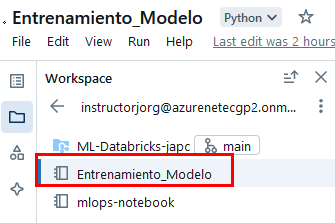
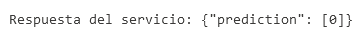
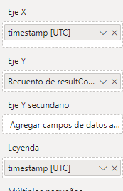

# Laboratorio 9. Creación de reportes y visualización de datos en Power BI.

## Objetivo de la práctica:

Al finalizar la práctica, serás capaz de:

- Crear un reporte demostrativo en Power BI utilizando datos de un modelo de Machine Learning desplegado en Azure.
- Integrar y visualizar datos de Azure Application Insights relacionados con el uso del modelo.
- Configurar un dashboard en Power BI para monitorizar el estado y las métricas del modelo.

## Objetivo Visual:


## Duración aproximada:
- 60 minutos.

## **Prerrequisitos:**

- Una cuenta de Azure con un Workspace de Azure Machine Learning configurado.
- Acceso a Power BI Desktop.
- Datos para entrenar un modelo de Machine Learning.
- Conocimientos básicos de Azure Machine Learning y Power BI.

## Instrucciones:

### Tarea 1. Entrenamiento y Despliegue de un Modelo en Azure Machine Learning.

En esta sección, vas a entrenar un modelo de Machine Learning para predecir si un pasajero del Titanic sobrevivió o no y,  finalmente, despliega este modelo en Azure Machine Learning.

1. Dirígete al Portal de Azure e inicia sesión con tu cuenta en [Azure Portal](https://portal.azure.com/).

2. En la barra de búsqueda del portal, escribe **`Machine Learning`** y selecciónalo.

3. Usa el **Workspace** de Azure Machine Learning **existente**, el cual fue creado previamente.

4. Haz clic en **`Launch Studio`**.

5. Dentro de tu workspace, selecciona **`Notebooks`** del menú lateral izquierdo.



6. En tu carpeta **raíz**, haz clic en los tres puntos para expandir el menú y selecciona **`Create new folder`**.


7. Escribe el siguiente nombre: **`titanic-model`**, y haz clic en el botón **`Create`**.


8. Repite los pasos, pero selecciona la carpeta creada y crea un archivo llamado **`titanic`** de tipo **Notebook**.


9. Haz clic en el botón **`Create`**.

10. En el cuaderno, ejecuta la **siguiente celda** para instalar las librerías requeridas y conectar al Workspace:

```
# Importar las librerías necesarias
from azureml.core import Workspace, Dataset, Experiment
from sklearn.model_selection import train_test_split
from sklearn.ensemble import RandomForestClassifier
from sklearn.metrics import accuracy_score, confusion_matrix, classification_report

from azureml.core import Workspace

# Cargar el workspace
ws = Workspace.from_config()

# Verificar la conexión
print("Workspace cargado:", ws.name)
```

11. En el cuaderno, ejecuta la **siguiente celda** para descargar la información:

```
import pandas as pd

# URL del dataset Titanic
url = "https://raw.githubusercontent.com/datasciencedojo/datasets/master/titanic.csv"

# Descargar el dataset directamente en un DataFrame de pandas
df = pd.read_csv(url)

# Guardar el dataset localmente para referencia futura
df.to_csv("titanic.csv", index=False)

# Mostrar las primeras filas para verificar
df.head()
```


12. Carga el dataset **Titanic** desde un archivo CSV y regístralo en el workspace de Azure Machine Learning para que esté disponible en futuras ejecuciones si es necesario si te aparece un **Warning** puedes omitirlo por el momento.

```
from azureml.core import Dataset
import pandas as pd
import os

# Cargar el dataset Titanic desde un archivo CSV local
# Asegúrate de tener el archivo 'titanic.csv' en tu directorio de trabajo
df = pd.read_csv("titanic.csv")

# Guardar el archivo CSV en el directorio de datos del workspace
datastore = ws.get_default_datastore()
datastore.upload_files(files=['titanic.csv'], target_path='datasets/titanic/', overwrite=True, show_progress=True)

# Registrar el dataset en el workspace
dataset = Dataset.Tabular.from_delimited_files(path=(datastore, 'datasets/titanic/titanic.csv'))
dataset = dataset.register(workspace=ws, name='titanic', description='Dataset Titanic', create_new_version=True)

print(f"Dataset registrado: {dataset.name}")
```


13. Antes de entrenar el modelo, necesitas limpiar y preparar los datos. Elimina las filas con valores nulos y selecciona las características relevantes para el modelo.

```
# Preprocesamiento básico: eliminar filas con valores nulos
df_clean = df.dropna()

# Selección de características
X = df_clean[['Pclass', 'Age', 'SibSp', 'Parch', 'Fare']]
y = df_clean['Survived']

# Dividir los datos en conjuntos de entrenamiento y prueba
X_train, X_test, y_train, y_test = train_test_split(X, y, test_size=0.2, random_state=42)

# Mostrar las dimensiones de los conjuntos de datos
print(f"Tamaño del conjunto de entrenamiento: {X_train.shape}")
print(f"Tamaño del conjunto de prueba: {X_test.shape}")
```


14.  Entrena el modelo de clasificación *Random Forest* utilizando las características seleccionadas. Este modelo aprenderá a predecir si un pasajero sobrevivió:

```
# Entrenar un modelo Random Forest
model = RandomForestClassifier(n_estimators=100, random_state=42)
model.fit(X_train, y_train)

# Realizar predicciones en el conjunto de prueba
y_pred = model.predict(X_test)

# Evaluación del modelo: precisión, matriz de confusión y reporte de clasificación
accuracy = accuracy_score(y_test, y_pred)
cm = confusion_matrix(y_test, y_pred)
report = classification_report(y_test, y_pred)

print(f"Precisión del modelo: {accuracy:.2f}")
print("Matriz de Confusión:")
print(cm)
print("Reporte de Clasificación:")
print(report)
```


- El modelo es más eficaz para predecir la supervivencia (clase 1) que la no supervivencia (clase 0).
- Tiene un buen desempeño en identificar correctamente a los sobrevivientes (recall alto en clase 1), pero tiene dificultades para identificar correctamente a los que no sobrevivieron (recall bajo en clase 0).
- La precisión general (0.68) es razonable, pero hay margen para mejorar, especialmente en la clasificación de no sobrevivientes.

15. Después de entrenar el modelo, regístralo en el Workspace de Azure Machine Learning para que esté disponible en el despliegue.

```
from azureml.core.model import Model

# Guardar el modelo entrenado localmente
import joblib
joblib.dump(model, "titanic_model.pkl")

# Registrar el modelo en Azure Machine Learning
model = Model.register(workspace=ws,
                       model_path="titanic_model.pkl",
                       model_name="titanic_model")

print(f"Modelo registrado: {model.name} - {model.version}")
```


16. Crea un nuevo entorno personalizado para el modelo:

```
from azureml.core import Environment
from azureml.core.conda_dependencies import CondaDependencies

# Crear un nuevo entorno
env = Environment(name="titanic-env")

# Añadir dependencias de Conda/Pip necesarias
dependencies = CondaDependencies.create(
    pip_packages=[
        'scikit-learn',
        'joblib',
        'azureml-core',
        'azureml-defaults'
    ]
)
env.python.conda_dependencies = dependencies

# Registrar el entorno en el workspace
env.register(workspace=ws)
```

> [!NOTE]
> El resultado de la creación del entorno sera representado en **JSON**, mientras no marque algún error puedes avanzar con los demás pasos.

17. Despliega el modelo como un servicio web utilizando **Azure Container Instances (ACI)**. Esto permitirá realizar predicciones a través de una API.

```
from azureml.core.model import InferenceConfig, Model
from azureml.core.webservice import AciWebservice, Webservice
import os

# Crear el script de inferencia (score.py) de forma convencional
script_content = """
import json
import joblib
import numpy as np
from azureml.core.model import Model

def init():
    global model
    # Cargar el modelo registrado
    model_path = Model.get_model_path('titanic_model')
    model = joblib.load(model_path)

def run(data):
    try:
        # Convertir la entrada en formato JSON
        data = json.loads(data)
        # Realizar predicciones
        prediction = model.predict(np.array(data['data']))
        return json.dumps({'prediction': prediction.tolist()})
    except Exception as e:
        error = str(e)
        return json.dumps({"error": error})
"""

# Guardar el script en un archivo llamado score.py
with open("score.py", "w") as file:
    file.write(script_content)

# Configurar el entorno de ejecución para la inferencia
env = ws.environments['titanic-env']
inference_config = InferenceConfig(entry_script="score.py", environment=env)

# Configurar el despliegue en ACI
aci_config = AciWebservice.deploy_configuration(cpu_cores=1, memory_gb=1)

# Nombre del servicio
service_name = "titanic-service"

# Comprobar si el servicio ya existe
try:
    service = Webservice(workspace=ws, name=service_name)
    print(f"El servicio {service_name} ya existe. Eliminando...")
    service.delete()
    print(f"Servicio {service_name} eliminado.")
except Exception as e:
    print(f"El servicio {service_name} no existe. Continuando con el despliegue...")

# Desplegar el modelo como un servicio web
service = Model.deploy(workspace=ws,
                       name=service_name,
                       models=[model],
                       inference_config=inference_config,
                       deployment_config=aci_config)
service.wait_for_deployment(show_output=True)

# Obtener la URL del servicio
print(f"Service URL: {service.scoring_uri}")
```

18. Valida que el servicio esté funcionando correctamente enviando una solicitud de predicción con datos de ejemplo. El resultado sera que: **No Sobrevivirá**.

```
import requests
import json

# Datos de ejemplo para la predicción (pasajero probable de sobrevivir)
data = {
    "data": [[3, 50.0, 1, 0, 50.0]]  # Ejemplo de un pasajero en tercera clase, 50 años, con hermanos, sin padres/hijos, tarifa 50.0
}

# URL del servicio web
scoring_uri = "TU_URL"

# Realizar la solicitud de predicción
headers = {"Content-Type": "application/json"}
response = requests.post(scoring_uri, data=json.dumps(data), headers=headers)

# Mostrar la predicción
print(f"Respuesta del servicio: {response.json()}")
```



19. En este ejemplo modificado y con un perfil de pasajero que tiene más probabilidades de sobrevivir:

```
import requests
import json

# Datos de ejemplo para la predicción (pasajero probable de sobrevivir)
data = {
    "data": [[1, 29.0, 0, 0, 100.0]]  # Ejemplo de un pasajero en primera clase, 29 años, sin hermanos, sin padres/hijos, tarifa 100.0
}

# URL del servicio web
scoring_uri = "TU_URL"

# Realizar la solicitud de predicción
headers = {"Content-Type": "application/json"}
response = requests.post(scoring_uri, data=json.dumps(data), headers=headers)

# Mostrar la predicción
print(f"Respuesta del servicio: {response.json()}")
```


Entrenaste un modelo de clasificación para predecir la supervivencia de pasajeros del Titanic utilizando un modelo Random Forest. Posteriormente, registraste y desplegaste este modelo como un servicio web en Azure Machine Learning. Finalmente, validaste el servicio desplegado enviando una solicitud de predicción con datos de ejemplo.

> **¡TAREA FINALIZADA!**

### Tarea 2. Integración de Azure Monitor.

Para monitorizar el modelo desplegado en Azure, primero debes activar los servicios adecuados y enviarlos al sistema de **Power BI**.

1.  Para iniciar, debes activar **Azure Application Insights** para capturar los logs y las métricas del servicio web.

```
from azureml.core.webservice import Webservice

# Conectar al servicio web desplegado
service = Webservice(workspace=ws, name="titanic-service")

# Habilitar Application Insights para el monitoreo
service.update(enable_app_insights=True)

print("Application Insights habilitado para el servicio web.")
```


2.  Genera solicitudes de predicción para que el servicio web procese datos. Esto permitirá que se recopilen datos en **Azure Application Insights**, que luego se usarán en **Power BI**.

```
import requests
import json

scoring_uri = "TU_URL"

# Datos de ejemplo para generar varias predicciones
test_data = [
    {"data": [[1, 29.0, 0, 0, 100.0]]},  # Alta probabilidad de supervivencia
    {"data": [[3, 22.0, 1, 0, 7.25]]},   # Baja probabilidad de supervivencia
    {"data": [[2, 34.0, 0, 1, 13.0]]},   # Media probabilidad de supervivencia
    {"data": [[1, 42.0, 1, 1, 52.0]]},   # Alta probabilidad de supervivencia
    {"data": [[3, 19.0, 0, 0, 8.05]]}    # Baja probabilidad de supervivencia
]

headers = {"Content-Type": "application/json"}

for data in test_data:
    response = requests.post(service.scoring_uri, data=json.dumps(data), headers=headers)
    print(f"Respuesta del servicio: {response.json()}")
```


3.  Con el endpoint desplegado, obtendrás la **URL** de **Application Insights**. Selecciona tu endpoint; `recuerda ir al menú lateral izquierdo y seleccionar **Endpoints.**`

4.  Dentro de las propiedades, busca la **URL** hasta el final de la pantalla y da **clic**.


5.  Se abrirá otra pestaña con el servicio **Application Insights**.

6.  Expande la propiedad del menú lateral izquierdo llamado **Monitoring** y selecciona **`Logs`**.


7.  Puedes cerrar la ventana emergente en la cruz superior derecha.

8.  Dentro del editor de la consulta, ejecuta el siguiente código para visualizar los resultados de la telemetría:

```
requests
| take 10
```


> [!IMPORTANT]
> **Los siguientes pasos serán de lectura solamente, ya que, si no tienes una cuenta empresarial para autenticarte en Azure y Power BI, no podrás autenticarte ni crear los reportes. PUEDE TOMARLOS COMO REFERENCIA Y AVANZAR A LA TAREA #3**

9.  Abre la aplicación **Power BI Desktop** en tu computadora o navegador web.

10. En la pantalla de inicio de Power BI Desktop, ve a la pestaña **"Inicio"** en la cinta de opciones. Haz clic en **`Obtener datos` (Get Data).**

11. En el panel de **"Obtener datos"**, selecciona **`Azure`** en la lista de categorías a la izquierda.

12. Luego, selecciona **`Azure Application Insights`**.

13. Te pedirá que introduzcas tus credenciales de Azure para autenticarte.

14. Selecciona tu **`Suscripción`** y **`Grupo de recursos`** donde se encuentra tu instancia de Application Insights.

15. Selecciona la **"Instancia de Application Insights"** a la que deseas conectarte.

16. Se abrirá un cuadro de diálogo para la autenticación. Introduce tus credenciales de Azure (si aún no has iniciado sesión). Autoriza a Power BI para acceder a tus datos de Application Insights.

Este flujo de trabajo proporciona una manera efectiva de monitorear y evaluar modelos en producción, además de crear reportes visuales y fácilmente interpretables en Power BI.

> **¡TAREA FINALIZADA!**

### Tarea 3. Creación del Reporte en Power BI.

En este paso, carga los datos de Azure Monitor y Azure Machine Learning desde Power BI Desktop para importar las métricas y datos relevantes.

1.  Si no puedes realizar una conexión directa al servicio de **Azure Application Insights**, realiza el ejemplo con carga de datos manual.

2.  Ve a la interfaz de los logs que usaste en la tarea anterior y realiza la siguiente consulta:

```
requests 
| take 100
```

3.  Selecciona la propiedad **`Export`** de la barra de propiedades y da clic en **`Export CSV` (All columns)**


4.  ¡Muy bien! Ahora, abre **Power BI Desktop** o **Power BI Web** y autentícate.

5.  En la pantalla de bienvenida, selecciona la opción **`Obtener datos de otros orígenes`**.


6.  En la ventana emergente, selecciona la opción **`Texto o CSV`** y busca los datos descargados en el paso anterior.


7.  En la siguiente ventana emergente, da clic en el botón **`Cargar`**.

8.  Agrega dos gráficas demostrativas para crear reportes.

9.  Selecciona la gráfica de **Gráfico de columnas apiladas** y se colocará en el canvas.


10. En las propiedades de los ejes, configura en **X = duration** y en el eje **Y = resultCode**. El resultado será el `recuento de código por duración`.


11. La gráfica se mostrará así:


12. Agrega una segunda gráfica de tipo **Gráfico de líneas**.


13. Para los ejes de esta gráfica, configura **X = timestamp [UTC]** y eje **Y = resultCode** con una leyenda de **timestamp[UTC]**.



14. Una vez configuradas las gráficas demostrativas, puedes publicar tu reporte. Da clic en la sección **`Publicar`**.


15. En la ventana emergente, da clic en **`Guardar`** y después elige el lugar donde deseas guardar el archivo.

16. Ya que está guardado, te saldrá una ventana emergente para publicarlo en el workspace de **Power BI**; selecciónalo.


17. Espera el proceso de publicación y da clic en el botón **`Entendido`**.

Estos pasos te permitirán crear un reporte en Power BI que muestre gráficas demostrativas sobre la información del modelo.

Este es un ejemplo sobre la creación de reportes de modelos de machine learning en Power BI: [Creación de un modelo de Machine Learning en Power BI](https://learn.microsoft.com/es-es/power-bi/connect-data/service-tutorial-build-machine-learning-model).

> **¡TAREA FINALIZADA!**

> **¡ELIMINAR ENDPOINT!**

1.  Agrega otra celda mas para eliminar el endpoint creado, copia el siguiente contenido a la celda y ejecutala.

```
from azureml.core import Workspace
from azureml.core.webservice import Webservice

# Conectar al Workspace
ws = Workspace.from_config()

# Nombre del servicio a eliminar
service_name = "titanic-service"

# Función para eliminar un servicio si existe
def delete_service_if_exists(service_name, workspace):
    try:
        # Obtener el servicio
        service = Webservice(workspace, name=service_name)
        
        # Verificar el estado del servicio y eliminar si está en estado Healthy
        if service.state == 'Healthy':
            print(f"Eliminando el servicio '{service_name}'...")
            service.delete()
            print(f"Servicio '{service_name}' eliminado exitosamente.")
        else:
            print(f"El servicio '{service_name}' no está en estado Healthy y no se eliminará.")
    
    except Exception as e:
        # Si el servicio no existe, se captura una excepción
        if 'Webservice' in str(e):
            print(f"Servicio '{service_name}' no encontrado. No se eliminará.")
        else:
            print(f"Error al eliminar el servicio '{service_name}': {str(e)}")

# Ejecutar la función para eliminar el servicio
delete_service_if_exists(service_name, ws)
```

### Resultado esperado:
El resultado esperado del laboratorio finalmente es ver las gráficas con la información que se generó desde la implementación de tu modelo.


